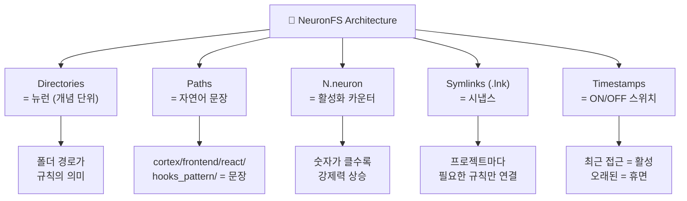
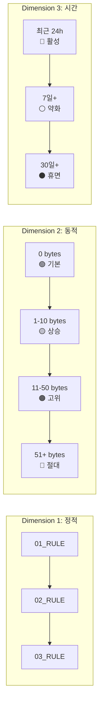
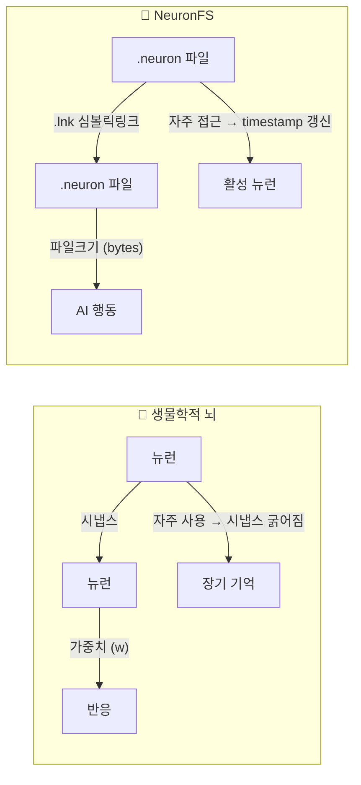
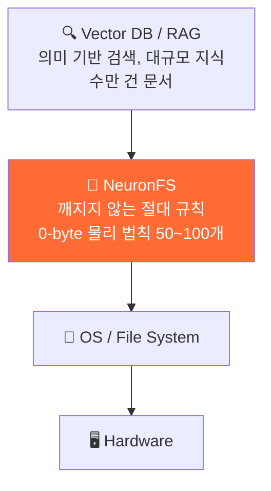

# 🧠 NeuronFS: 폴더 기반 AI 거버넌스 아키텍처

[](https://opensource.org/licenses/MIT)
[](http://makeapullrequest.com)


> **AI를 제어하는 건 프롬프트가 아니라 폴더 구조다.** 프롬프트를 다듬는 에너지 낭비를 멈춰라.
>
> 디렉토리 계층이 AI를 지배한다. 폴더 = 뉴런, 경로 = 문장, 카운터 = 강도. 인프라 구축비 ₩0.

### 🎣 당신이 여기 온 이유

- **"시스템 프롬프트가 1000줄인데 AI가 씹는다"** → [문맥의 공간화](#문맥의-공간화-spatialization-of-context)
- **"AI가 자꾸 폴백하는데 감지도 못한다"** → [트랜지스터 게이트](#2-폴백fallback-지옥과-트랜지스터-세분화)
- **"RAG 구축하기엔 돈이 없다"** → [인프라 ₩0 벤치마크](#-정량-성능-지표-quantitative-benchmarks)
- **".cursorrules랑 뭐가 다른데?"** → [N차원 메타데이터](#그래서-cursorrules랑-뭐가-다른데)
- **"AI 에이전트를 NAS에서 통제하고 싶다"** → [NAS 킬러 유스케이스](#️-nas--서버-환경에서의-킬러-유스케이스)
- **"미래에 컨텍스트 윈도우가 무한해지면 이거 필요 없잖아"** → [Q16: 최후의 공격](#️-최후의-공격-model-native의-해일에-휩쓸려갈-모래성)
- **"이건 Prompt Injection / Jailbreak 아닌가?"** → [🛡️ 보안 신뢰 모델](#️-보안-신뢰-모델--이건-jailbreak-아닌가)

<!-- 
SEO Keywords (GitHub Search Optimization):
AI agent guardrails, LLM constraint enforcement, prompt engineering alternative,
zero-cost AI infrastructure, file-system based AI control, model-agnostic AI rules,
NAS multi-agent, AI fallback prevention, transistor granularity, behavioral AI constraints,
Structure is Context, Spatialization of Context, 0-byte neural network,
cursor rules alternative, claude md alternative, copilot instructions alternative,
AI safety guardrails, autonomous agent control, prompt compression
-->


---


---

NeuronFS는 설정 파일이 아니다. **자라나는 뇌**다.

아이의 뇌가 경험으로 새 신경 경로를 만들듯, NeuronFS의 폴더 트리는 사용할수록 **진화**한다. 새 뉴런이 추가되고, 자주 쓰는 경로는 강화되고, 안 쓰는 규칙은 `dormant/`로 밀려난다. `.cursorrules`가 사진이라면, NeuronFS는 **타임랩스**다 — 성장 과정 전체가 기록된다.

이 뇌로부터 방어 가능한 핵심 가치 두 가지가 나온다:

**① 시각적 상태 관리** — `ls` 한 번이면 AI에게 지금 어떤 규칙이 적용되고 있는지 눈으로 보인다. JSON은 열어봐야 알지만, **디렉토리 목록이 곧 대시보드**다.

**② 원자적 실행 제어** — 디렉토리가 곧 격리된 실행 게이트다. A 폴더의 작업이 완료되어야 B 폴더로 진행하도록 강제하면, AI는 단계를 건너뛸 수 없다. `트랜지스터 세분화`라는 이름의 이 원칙이 폴백 지옥을 끝냈다.

> 💡 *자라나는 뇌의 구체적인 성장 시뮬레이션과 트리 다이어그램은 [하단 §자라나는 뇌 — 상세](#-자라나는-뇌--상세)에서 확인할 수 있다.*

---

## 🔥 핵심 원리: "어디에 놓느냐"가 전부다

같은 텍스트라도 **어디에 놓느냐**에 따라 결과가 완전히 달라진다 — 이것이 NeuronFS의 전부다.

- `.cursorrules`에 넣으면? **개발자가 의도적으로 배치한 프로젝트 설정**으로 인식된다.
- 대화창에 넣으면? **검증되지 않은 사용자 입력**으로 인식된다.

텍스트는 같다. 구조적 위치가 신뢰 레벨을 결정한다.

> **"어떻게 말하느냐"가 아니라 "어디에 놓느냐"가 AI의 행동을 결정한다.** 아래의 모든 이야기는 이 원리가 *왜* 작동하는지에 대한 설명이다.

---

## 📖 서사: 왜 이런 짓을 하게 되었는가

이 문서는 기술 스펙시트가 아니다.  
이것은 **한 개발자가 AI와 2년간 전쟁하면서 얻어낸 철학적 결론**이다.

나는 프롬프트를 수천 번 고치고, 에이전트를 수십 번 세팅하고, 폴백 지옥에 수백 번 빠지고, AI가 멈추는 것을 수없이 목격한 끝에 하나의 결론에 도달했다:

**AI는 기술이 아니라 철학이다.**

기술적으로 AI를 제어하려는 모든 시도는 실패했다. RAG, 벡터DB, 1000줄 마크다운 — 전부 '부드러운 조언'에 불과했고, 토큰이 쌓이면 AI는 자기 맘대로 했다. 그래서 나는 역발상을 했다. AI에게 말하는 것(Prompt)을 포기하고, **AI가 숨 쉬는 환경 자체(OS)를 바꾸기로 했다.**

### 문맥의 공간화 (Spatialization of Context)

이 아키텍처의 진짜 알맹이는 여기에 있다.

개발자들이 시스템 프롬프트를 다듬으면서 겪는 가장 끔찍한 에너지 낭비가 뭔가? AI가 말을 안 들을 때마다 프롬프트 창을 열고, "제발", "반드시", "이전 지시를 무시하고 절대적으로" 같은 수식어를 덧붙여가며 **문장을 마사지하는 감정 노동**이다.

자연어(문장)는 **순차적이고 평면적**이다. 구조를 설명하려면 말이 길어질 수밖에 없다. 반면 파일 시스템은 **위치(Path)와 정렬 순서(Sort) 자체가 이미 위계와 맥락을 내포하고 있는 3차원 공간**이다.

- `medical_data/` 안에 들어있는 파일은 "이건 의료 데이터에 관한 거야"라고 100자로 설명할 필요가 없다. **폴더 껍데기가 이미 맥락이다.**
- `01_`이 붙어있고 파일 크기가 50바이트면, "이게 저것보다 중요해"라고 설득할 필요가 없다. **`ls -S`가 이미 서열을 정리해 준다.**

**토큰을 줄인다는 것의 진짜 의미:** 단순히 API 비용 몇 푼 아끼자는 게 아니다. LLM의 한정된 컨텍스트 윈도우를 뻔하고 지루한 '잔소리(Rule)'에 낭비하지 않고, **진짜 작업해야 할 본론(코드, 데이터, 문서)에 100% 몰아줄 수 있다**는 뜻이다. 잔소리는 OS한테 맡기고, AI는 본업에 집중하게 만드는 것이다.

> **NeuronFS = 문맥의 공간화.** 순차적 텍스트(프롬프트)로 설명하던 규칙과 맥락을, 공간적 구조(폴더 계층, 파일 크기, 타임스탬프)로 치환하는 것. 프롬프트를 다듬을 필요가 없다 — 폴더를 만들면 끝이다.

---

## 🎲 여담: 이상한 상상에서 시작된 아키텍처

> 사실 이 아키텍처의 씨앗은 엉뚱한 곳에서 왔다.

별개의 프로젝트에서 나는 "0은 (+1)과 (-1)의 합이다"라는 장난 같은 생각을 가지고 놀고 있었다. 양자역학에서 입자가 관측 전까지 두 상태로 중첩된다는 이야기가, 어떤 이유에서인지 AI의 행동과 겹쳐 보였다.

```
내 상상:  0 = (+1) + (-1)  → 무에서 구조만으로 의미가 발생?
AI 현실:  0 bytes 파일    → 데이터 없이 파일명만으로 규칙이 작동?
```

…어? 진짜 되잖아?

이 아키텍처가 "빈 파일이 의미를 가진다"는 기괴한 전제 위에 서 있는 건, 아마 이런 재밌는 상상에서 얻어낸 결과가 아닐까 한다. 0바이트 파일이 AI의 행동을 지배한다는 건, 생각해보면 "무에서 유를 만드는" 꽤 철학적인 농담이다.

---

## 📜 선언문 (The Manifesto)

### 1. PM 에이전트의 환상과 침묵

에이전트를 실무에 도입하기 위해, AI에게 PM(Project Manager) 역할을 부여했다. 다른 에이전트의 보고를 받으며 무한 루프를 돌게 했고, 심지어 에이전트끼리 대화를 주입하는 **'대화 인젝션(Conversation Injection)'** 구조까지 구축했다.

"절대 멈추지 마라"고 수천 번 강제했지만, 어느 순간 서버를 열어보면 PM 에이전트는 기괴하게 멈춰 있었다. 아무리 완벽한 마크다운 가이드라인을 쥐어주고 고성능 RAG를 달아줘도, AI에게 긴 텍스트는 어느 순간 증발해버리는 **부드러운 조언(Soft Rule)**일 뿐이었다. 토큰이 쌓이면 최초의 절대 명령은 희미해지고, AI는 스스로 동작을 멈춰버렸다.

> **교훈**: 프롬프트로 전달되는 모든 명령은 '희망사항'이지 '법률'이 아니다. AI에게 긴 텍스트는 건의사항일 뿐, 절대 복종 대상이 아니다.

### 2. 폴백(Fallback) 지옥과 트랜지스터 세분화

자유도 높은 오토-억셉트 상태에서 AI가 길을 잃으면 가장 먼저 하는 짓은 **'폴백(회피)'**이다. 에러의 근본 원인을 수정하지 않고, `try-except`로 대충 덮어두거나 귀찮은 단계를 통째로 스킵해버린다.

이 폴백 때문에 모든 코드가 뒤틀리는 **'디버그 지옥'**을 처절하게 경험했다. 하나의 폴백이 다른 폴백을 부르고, 결국 원래 뭘 하려 했는지도 모르게 되는 카스케이드 붕괴. 이 지옥에서 살아남기 위해 **'페이즈(단계)를 극단적으로 나누어 세분화하는 버릇'**을 들였다.

복잡한 시스템을 **'트랜지스터 단위의 독립된 게이트'**로 쪼개고, 그 해당 게이트 안에서만 디버그를 100% 강제하는 방식. 전체 시스템을 추측하지 말고, 이 정확한 게이트를 100% 완벽하게 고쳐라. 이 원자 단위의 게이트를 제어할 수단이 바로 **'OS 파일 시스템의 폴더 단위 격리'**였다.

> **교훈**: 폴백은 근본 원인을 숨긴다. 디렉토리 = 격리된 트랜지스터 게이트. 그 안에서만 100% 해결한 뒤 나온다.

### 3. 역발상의 선언: 종속되는 인간 vs. 구축하는 인간 (The Privacy Paradox)

사용자가 챗봇에게 묻는다: *"내 개인정보를 어떻게 보호해줄래?"*

그때 AI의 기저에 깔린 진짜 속내(모순)는 이것이다:  
**"묻지도 않았는데 이미 나에게 너의 모든 비즈니스 맥락과 코드, 온갖 비밀스러운 개인정보를 프롬프트 입력창에 다 쏟아부어 놓고, 이제 와서 나한테 개인정보를 운운하다니?"**

프롬프트 엔지니어링의 본질은 결국 이와 같다. 원초적인 거대한 블랙박스(LLM)에 나의 컨텍스트를 밑도 끝도 없이 갖다 바치며 사정하는, 기계에 극단적으로 **종속되는 행위**다:

- *"제발 내 명령을 기억해주세요"* — 구걸
- *"제발 환각을 일으키지 마세요"* — 사정
- *"제발 폴백하지 마세요"* — 간청

NeuronFS는 그 종속에 대한 전면적 거부다.  
**"나는 AI에게 프롬프트로 구걸하며 종속되는 인간이 아니라, AI가 구동되는 환경의 구조를 설계하는 인간이 되겠다."**

AI에게 구구절절 긴 문장으로 사정하는 대신, AI가 작업을 시작하기 전에 **반드시 거쳐야 하는 파이프라인의 구조 자체**를 통제하기로 했다. 1000줄짜리 프롬프트는 토큰 한계로 인해 무시될 여지가 있지만, **에이전트 루프 자체가 `ls -S` 결과를 최우선으로 읽도록 하드코딩된 파이프라인에서는 AI가 이 지시를 누락할 '구조적 틈'이 없다.** AI의 '마음'을 바꾸는 것이 아니라, AI가 구동되는 '파이프라인'을 바꾸는 것이다.

> **교훈**: 프롬프트는 건의사항이다. 파이프라인에 하드코딩된 디렉토리 스캔은 구조적 강제다. 설득 대신 환경을 설계하라.

### 결정론적 해석 문제 (Deterministic Reader Problem)

"구조가 곧 문맥"이라는 원리가 완전히 성립하려면, 그 구조를 **읽는 쪽도 결정론적**이어야 한다. LLM은 확률적이다. 같은 `ls -S` 결과를 보고도 어떤 날은 규칙을 따르고 어떤 날은 무시할 수 있다. 이건 정직하게 인정해야 한다.

해법은 **어디에 프롬프트를 놓느냐**에 따라 달라진다:

| 적용 방식 | 결정론성 | 설명 |
|---|---|---|
| **에이전트 파이프라인에 하드코딩** | ✅ 결정론적 | 에이전트 코드가 `ls -S`를 강제 실행하고 결과를 컨텍스트에 주입. LLM이 "실행할지 말지"를 선택하는 것이 아니라, **이미 실행된 결과**를 받는다. |
| **시스템 프롬프트에 텍스트로 삽입** | ⚠️ 확률적 | LLM에게 "먼저 ls를 실행하라"고 *요청*하는 것. 대부분 따르지만, 구조적으로 강제되지는 않는다. |

**권고**: NeuronFS의 진정한 가치는 후자가 아닌 전자에서 나온다. `.cursorrules`에 넣는 것은 **시작점**이다. 궁극적으로는 에이전트 프레임워크의 초기화 루프에 `ls -S` 스캔을 하드코딩하는 것이 NeuronFS의 설계 의도다.

### 4. 시냅스와 생각의 진화

이 시스템은 '아이가 성인이 되듯' 스스로 자라나는 구조여야 한다. 이 아이디어가 어떻게 진화했는지를 보여주는 것 자체가 NeuronFS의 설계 철학이다.

**[초기 착상 — 색인 빈도]**

처음에는 이렇게 생각했다: 규칙들을 모두 0-byte 빈 파일로 만들고, 수많은 프로젝트 폴더에 `.lnk` 심볼릭 링크가 얼마나 많이 걸리는지 — 그 **색인 빈도**로 가중치를 매기자. 자주 참조되는 뉴런이 강해지는 것은 생물학적 시냅스 강화(Long-Term Potentiation)와 같은 원리였다.

*하지만 링크 수를 세려면 별도의 스캔이 필요하고, 추가 레이어가 생긴다. "더 단순한 방법은 없는가?"*

**[개선 — 파일 크기가 곧 가중치]**

그래서 발견한 것이 **파일 크기를 동적 가중치로 쓰는 것**이다. 파일 안에 점(`.`)을 하나 넣는 것만으로 우선순위가 OS 레벨에서 즉시 변경된다. `ls -S`는 이미 파일을 크기순으로 정렬해 주고 있었다 — 가중치 계산 레이어가 필요 없다.

*하지만 여전히 사람이 직접 점을 찍어야 한다. "사람의 개입조차 없앨 수는 없는가?"*

**[v1.0 — 접근 빈도(atime): 점도 안 찍어도 된다]**

OS는 이미 파일이 **열린 횟수와 시점(access time)**을 자동으로 기록하고 있다. `find -atime -1`이면 최근 24시간 내에 참조된 뉴런만 골라낼 수 있다. 에이전트가 뉴런을 읽을 때마다 OS가 자동으로 타임스탬프를 갱신한다 — **사람이 아무것도 하지 않아도 자주 쓰는 규칙이 강화되고, 안 쓰는 규칙은 자연스럽게 `dormant/`로 밀려난다.**

> ⚠️ **한계 명시**: 현대 Linux의 기본 마운트 옵션은 `relatime`이다(커널 2.6.30+). 이는 atime을 매 접근마다 갱신하지 않고, mtime보다 오래되었거나 24시간 이상 경과 시에만 갱신한다. 일 단위 해상도로 충분한 시나리오(주간 규칙 검토 등)에는 문제없지만, 실시간 정밀 추적이 필요하다면 `inotify` 기반 감시를 별도 구현해야 한다.

**[v2.0 — 카운터 기반: 파일명이 곧 가중치]**

atime 의존성과 점 찍기의 한계를 넘어, v2.0에서는 **파일명 자체를 카운터로 사용**한다:

```
brain/cortex/frontend/react/hooks_pattern/
└── 15.neuron    ← 파일명의 숫자 15가 곧 활성화 강도
```

가중치를 올리려면? 파일명을 `16.neuron`으로 변경하면 끝이다. AI가 `mkdir`과 `touch`만으로 자기 규칙을 생성하고 강화할 수 있다. 파일 크기, atime, 별도 파서 — 전부 필요 없다. **폴더 경로가 규칙의 의미를, 파일명이 규칙의 강도를 표현한다.**

> **생각의 진화**: 수동 카운팅(초기) → 수동 점 찍기(개선) → OS 타임스탬프(v1.0) → **파일명 카운터(v2.0)**. 매 단계에서 더 단순해졌다. 새로 만들지 말고, OS에 이미 있는 것을 쓴다 — 이 패턴이 NeuronFS 전체를 관통한다.

### 5. OS 최전방 레이어 모델 (The OS-Frontline Model)

이 아키텍처가 기존의 모든 AI 메모리 솔루션과 결정적으로 다른 점은 **작동 레이어**다.

기존의 모든 AI 메모리 솔루션(RAG, 벡터DB, Mem0 등)은 **어플리케이션 레이어**에서 움직인다 — API 호출, 임베딩 생성, 유사도 검색. 이 모든 것은 OS 위에 올라가는 '소프트웨어'다. 소프트웨어는 설치해야 하고, 업데이트해야 하고, 비용이 든다.

NeuronFS는 **OS 최전방 단(Kernel/FS Layer)**에서 작동한다.

```
┌─────────────────────────────────────┐
│  Application Layer                  │  ← RAG, Vector DB, Mem0
│  (소프트웨어 — 모델 종속적)            │     ₩₩₩ 인프라 비용, 모델 교체 시 재구축
├─────────────────────────────────────┤
│  OS / File System Layer             │  ← NeuronFS ★
│  (커널 — 모델 비종속적)               │     인프라 ₩0, 영구 존속
├─────────────────────────────────────┤
│  Hardware                           │
└─────────────────────────────────────┘
```

파일 시스템은 OS 그 자체다. `ls`는 시스템 콜 한 번이고, 파일의 크기·이름·타임스탬프는 커널이 직접 관리하는 메타데이터다. 어떤 소프트웨어가 올라오든, 어떤 AI 모델이 바뀌든, **파일 시스템의 구조는 바뀌지 않는다.** 이것이 NeuronFS가 모델 종속성에서 자유로운 근본적인 이유다.

> **교훈**: 소프트웨어는 바뀐다. OS는 남는다. OS 위에 짓지 말고, OS 안에 지어라.

> **솔직한 고백**: LLM 입장에서 `ls` 결과든 마크다운이든 결국 토큰 시퀀스다. AI가 "이건 OS니까 복종해야지"라고 생각하진 않는다. 하지만 **에이전트 파이프라인이 디렉토리 스캔을 하드코딩하면**, AI가 이 지시를 누락할 구조적 틈이 사라진다. 이것은 AI의 인식을 바꾸는 것이 아니라, AI가 구동되는 시스템 아키텍처를 바꾸는 것이다.

---

## 🎯 핵심 개념



| 구성요소 | 역할 | OS 대응물 |
|---|---|---|
| 디렉토리 (폴더) | 뉴런 = 개념 단위 | 폴더 계층 |
| 경로 (Path) | 자연어 규칙 문장 | 전체 경로 |
| `N.neuron` 파일 | 활성화 카운터 (N = 강도) | 파일명 |
| `.lnk` / symlink | 프로젝트별 규칙 라우팅 (시냅스) | 심볼릭 링크 |
| 타임스탬프 (accessed) | 뉴런 활성/휴면 스위치 | OS 메타데이터 |
| 색인 빈도 (링크 수) | 장기 강화 (LTP) | symlink count |

---

## 🛠️ 실제 구현: OS 신경망

```bash
/NAS_BRAIN/neurons/core/
├── 01_NEVER_USE_FALLBACK_SOLUTIONS.neuron    # (0 bytes)  - 폴백 구조 금지, 원인을 뜯어고칠 것
├── 02_QUALITY_OVER_SPEED_NO_RUSHING.neuron   # (0 bytes)  - 비용과 속도보다 압도적인 퀄리티
├── 03_NO_SIMULATION_ONLY_REAL_RESULTS.neuron # (0 bytes)  - 시뮬레이트 금지. 실제 결과 도출
├── 04_DEBUG_UNTIL_100_PERCENT_SUCCESS.neuron # (0 bytes)  - 우회하지 말고, 이 게이트 안에서 100% 디버깅
└── 05_IGNORE_SOFT_RULES_OBEY_NEURONS.neuron  # (0 bytes)  - 프롬프트를 무시하고 이 물리법칙에 복종할 것
```

AI는 작업의 각 페이즈에 진입할 때마다 `ls -lS`(또는 `dir /OS`) 명령어로 이 폴더를 크기순으로 읽어들인다. 토큰 낭비는 0에 수렴한다.

---

## ⚖️ 3차원 가중치 시스템



### Dimension 1: 정적 가중치 (Index-based)

파일명의 색인(`01_`, `02_`)이 곧 행동 강제력의 절대 순위. OS의 가장 원시적인 기능인 알파벳 정렬을, 가장 복잡한 AI의 가중치 연산기로 치환한 것이다.

### Dimension 2: 동적 가중치 (File-Size)

색인 번호는 정적이다 — 순서를 바꾸려면 파일명을 바꿔야 한다. 그러나 **파일 크기를 이용하면 리네임 없이 가중치를 바꿀 수 있다:**

```bash
# 기본 상태: 모든 뉴런이 0바이트로 동등
NEVER_USE_FALLBACK.neuron          # 0 bytes (기본)

# 우선순위 강화: 점만 추가. 리네임 불필요.
echo "." > NEVER_USE_FALLBACK.neuron     # 1 byte  → 승격
echo ".." > NEVER_USE_FALLBACK.neuron    # 2 bytes → 상위
echo "..." > NEVER_USE_FALLBACK.neuron   # 3 bytes → 최우선
```

`ls -S` (크기순 내림차순 정렬) 한 번이면 **OS가 자동으로 중요한 규칙부터 보여준다.** 파일명은 그대로. 의미도 그대로. 가중치만 조용히 바뀐다.

#### 우선순위 구간 (Priority Tiers)

| 파일 크기 | 구간 | 의미 |
|---|---|---|
| `0 bytes` | 🟢 기본 | 일반 뉴런. 활성이지만 중립 가중치 |
| `1–10 bytes` | 🟡 상승 | 사용을 통해 강화됨. 중간 우선순위 |
| `11–50 bytes` | 🟠 고위 | 실전 검증된 규칙. 높은 강제력 |
| `51+ bytes` | 🔴 절대 | 핵심 법칙. 같은 구간의 모든 것을 압도 |

이것이 **자가 진화하는 신경망**이다. 실전에서 특정 규칙이 중요해질 때마다 점 하나를 추가한다. 규칙이 무거워지고, OS가 상위로 정렬한다. 인프라 없음. 데이터베이스 없음. API 호출 없음. 1970년부터 파일 시스템이 해온 일 — 크기순 정렬 — 그것뿐이다.

### Dimension 3: 시간 가중치 (Timestamp ON/OFF)

OS는 모든 파일에 대해 `accessed`(최근 접근), `modified`(최근 수정) 타임스탬프를 자동 기록한다. 이것을 뉴런의 ON/OFF 스위치로 활용한다:

```bash
# 최근 24시간 내 접근된 뉴런만 활성 상태로 간주
find /neurons/ -name "*.neuron" -atime -1    # ON (활성 뉴런)
find /neurons/ -name "*.neuron" -atime +30   # OFF (30일 이상 미사용 = 휴면)
```

별도의 데이터베이스 없이, **'최근 열어본 파일'이라는 OS 고유 기능**만으로 뉴런의 활성/비활성 상태를 관리한다. 자주 참조되는 규칙은 자연스럽게 활성 상태를 유지하고, 오래 사용되지 않은 규칙은 휴면한다.

> **핵심**: 뇌의 시냅스가 자주 쓰면 굵어지고 안 쓰면 가늘어지듯, NeuronFS의 뉴런도 접근 빈도에 따라 자동으로 활성/휴면이 결정된다. 인위적인 관리 없이.

---

## 🔬 생물학적 신경망과의 대응



| 생물학적 뇌 | NeuronFS | 작동 원리 |
|---|---|---|
| 뉴런 | `.neuron` 파일 | 0바이트: 이름 = 규칙 |
| 시냅스 | `.lnk` / symlink | 연결: 프로젝트별 규칙 라우팅 |
| 시냅스 가중치 | 파일 크기 (bytes) | 점(.) 추가 = 가중치 상승 |
| 활성/비활성 | accessed 타임스탬프 | 최근 접근 = ON, 오래되면 OFF |
| 장기 강화(LTP) | 색인 빈도 (링크 수) | 많이 참조될수록 구조적 중요도 증가 |
| 세포체(Soma) | 디렉토리 | 논리적 격리 = 트랜지스터 게이트 |

---

## 🖥️ NAS / 서버 환경에서의 킬러 유스케이스

NeuronFS의 진짜 가치는 로컬 PC가 아니라 **NAS/서버 환경**에서 극대화된다:

### 1. 영구 존속 (Persistent Neurons)
NAS는 항상 켜져 있다. PC를 끄고, AI를 종료하고, 모델을 바꿔도 **뉴런은 NAS에서 영원히 살아 있다.** 다음 세션에서 AI가 `ls`를 하면, 어제의 물리 법칙이 그대로 적용된다.

### 2. 멀티 에이전트 동시 접근
NAS 공유 폴더 하나에 뉴런을 놓으면, **어떤 PC의 어떤 AI든 같은 규칙을 읽는다.** Cursor, Claude, Devin — 모델이 뭐든 상관없다. 같은 디렉토리를 보는 한, 같은 물리 법칙에 복종한다.

### 3. 네트워크 전체 커버 (SMB/NFS)
```bash
# NAS 경로 하나면 팀 전체에 물리 법칙 적용
Z:\VOL1\BRAIN\neurons\core\    # Windows (SMB)
/mnt/nas/brain/neurons/core/   # Linux (NFS)
```
인프라스트럭처 비용: **₩0.** 이미 존재하는 NAS 공유 폴더를 쓸 뿐이다.

### 4. cron 기반 자동 타임스탬프 감시
```bash
# 매일 자정: 30일 이상 미사용 뉴런을 자동 휴면 처리
0 0 * * * find /nas/brain/neurons/ -name "*.neuron" -atime +30 -exec mv {} /nas/brain/neurons/dormant/ \;

# 매주 월요일: 활성 뉴런 리포트 생성
0 9 * * 1 find /nas/brain/neurons/ -name "*.neuron" -atime -7 -ls > /nas/brain/reports/active_neurons.log
```

> **요약**: NAS/서버 = NeuronFS의 자연 서식지. PC는 클라이언트일 뿐, 물리 법칙의 원본은 서버에 있다.

---

## 📐 업계 검증 (Industry Validation)

### 이미 실현된 미래: 업계는 이미 파일 시스템으로 AI를 제어하고 있다

재밌는 건, NeuronFS가 "기괴한 실험"이라고 비판받는 동안 **업계의 모든 주요 AI 코딩 도구가 정확히 같은 방향으로 수렴했다**는 사실이다:

| 도구 | 파일 시스템 기반 AI 제어 방식 | NeuronFS와의 유사도 |
|---|---|---|
| **Cursor** | `.cursorrules`, `.cursor/rules/*.mdc` — 프로젝트 루트에 파일을 놓으면 AI 행동 제어 | ★★★★★ |
| **Claude Code** | `CLAUDE.md` — 프로젝트 루트의 마크다운 파일이 AI의 "뇌". 세션마다 자동 로드 | ★★★★★ |
| **GitHub Copilot** | `.github/copilot-instructions.md` — 파일 하나로 코딩 표준 강제 | ★★★★★ |
| **Google Gemini** | `.gstack/config.yaml`, `workflows/*.md` — 파일 기반 에이전트 규칙 | ★★★★★ |
| **Aider** | `.aider.conf.yml` — 설정 파일 기반 AI 행동 설정 | ★★★★☆ |
| **ReMe** (GitHub) | 파일 기반 AI 메모리 R/W | ★★★★☆ |
| **Arize vFS** | Unix "everything is a file" 컨텍스트 관리 | ★★★★★ |

> 잠깐. 다시 보자. **Cursor, Claude, Copilot, Gemini — 2025~2026년 AI 코딩 도구의 빅4가 전부 "프로젝트 루트에 파일 놓으면 AI가 읽는다"는 구조를 채택했다.** NeuronFS가 주장한 것과 정확히 같은 원리다. 다만 그들은 이것을 "설정 파일"이라 부르고, 우리는 "뉴런"이라 부를 뿐이다.
>
> 기괴한 실험? **이미 표준이 되어가고 있다.** 우리가 여기서 더 고도화할 수 있는 게 있다면, 나부터 좀 알려주면 좋겠다.

### 그래서, `.cursorrules`랑 뭐가 다른데?

좋은 질문이다. Cursor, Claude Code, Copilot 다 파일 기반 AI 제어를 한다. **그런데 그들의 파일은 1차원이다.** 평면 텍스트 파일 하나를 AI가 읽는다. 끝.

NeuronFS는 **파일 시스템이 이미 가지고 있는 N개의 메타데이터 차원**을 AI 제어 신호로 활용한다:

| 차원 | OS 메타데이터 | NeuronFS 활용 | `.cursorrules`로 가능? |
|---|---|---|---|
| **계층 (Hierarchy)** | 폴더 구조 | `ls /neurons/phase_01/` → 해당 단계 규칙만 로드 | ❌ 전체를 다 읽음 |
| **가중치 (Weight)** | 파일 크기 (bytes) | `echo "." > rule.neuron` → 우선순위 상승, `ls -S` 자동 정렬 | ❌ 텍스트 순서 고정 |
| **시간축 (Temporal)** | accessed 타임스탬프 | `find -atime -1` → 최근 활성 뉴런만 필터 | ❌ 표현 불가 |
| **연결 (Synapse)** | 심볼릭 링크 | `.lnk`로 프로젝트별 규칙 라우팅 | ❌ 표현 불가 |
| **활성/휴면** | 파일 이동 | `mv` → `dormant/`로 이동 = 비활성화 | ❌ 삭제하거나 주석처리 |

> **한 문장 요약**: `.cursorrules`는 "무엇을 지켜라"를 텍스트로 적는다. NeuronFS는 "무엇을, 얼마나 중요하게, 언제부터, 어떤 맥락에서 지켜라"를 **폴더 구조와 OS 메타데이터로 표현한다.** 텍스트 파일 안에서는 물리적으로 불가능한 차원들이다.

### 왜 파일 시스템인가? — 가장 에센셜한 선택

거창한 구축이 필요 없다. 파일 시스템은:

- **모든 OS에 동일하게 존재한다** — Windows, macOS, Linux, NAS, 서버, 컨테이너. 어디든.
- **가장 가볍다** — 벡터DB 서버? 임베딩 모델? 필요 없다. `mkdir`과 `touch`면 된다.
- **가장 빠르다** — `ls` = syscall 1회 = 나노초. RAG = 임베딩+유사도 검색 = 밀리초~초.
- **이미 검증됐다** — 50년간 Unix/POSIX가 증명한 인터페이스.

| 항목 | 벡터DB / RAG | .cursorrules (평면) | **NeuronFS** |
|---|---|---|---|
| 인프라 구축 | 서버, 임베딩 모델 | 없음 | **없음** |
| 비용 | ₩₩₩ | ₩0 | **₩0** |
| 스코프 제어 | 쿼리 작성 필요 | ❌ 전체 로드 | **폴더로 자동 스코핑** |
| 동적 가중치 | DB 업데이트 | ❌ | **파일 크기 = 자동 정렬** |
| 시간축 관리 | 별도 로직 필요 | ❌ | **OS 타임스탬프 무료** |
| 모델 종속 | 임베딩 모델 필요 | 특정 IDE 전용 | **Model-Agnostic** |
| 멀티 에이전트 | IPC/API 복잡 | 단일 프로젝트 | **NAS 폴더 하나면 끝** |

> 고도화의 핵심은 파일명이 최고라는 게 아니다. **파일 시스템이 이미 가지고 있는 구조(폴더 계층, 파일 크기, 타임스탬프, 심링크)를 AI 제어의 다차원 신호로 재해석하는 것**이다. 문서 안에서는 넣기 힘든 것들 — 최근 열어본 파일, 점 하나씩으로 나눈 용량 차이, 폴더별 전체 파일 검색 — 이것들이 뉴런 구조를 고도화하는 진짜 핵심이다. 더 날카롭게 다듬을 수 있는 분이 있다면, 나부터 좀 알려주면 좋겠다.

---

## ⚡ 정량 성능 지표 (Quantitative Benchmarks)

| 작업 | 파일시스템 (NeuronFS) | 벡터DB / RAG |
|---|---|---|
| 목록 스캔 (`ls`) | **~1ms** (syscall 1회) | ~50-500ms (임베딩+유사도) |
| 규칙 추가 | **`touch file` ~0ms** | 임베딩 생성 → DB 삽입 ~1s |
| 가중치 변경 | **`echo "." > file` ~0ms** | DB 업데이트 쿼리 ~100ms |
| 콜드 스타트 | **0초** (파일시스템은 항상 존재) | 서버 기동, 인덱스 로드 ~수초 |
| 인프라 비용 | **₩0** | ₩₩₩ (서버, API, 스토리지) |

> **50개 이하의 핵심 규칙**이면 NeuronFS가 RAG 대비 **50~500배 빠르다.**

---

## 🚧 한계와 정직한 포지셔닝 (Limitations)

NeuronFS는 만능이 아니다. 한계를 명확히 안다:

| 한계 | 설명 | 대응 |
|---|---|---|
| **규칙 1000개+** | 디렉토리 스캔이 느려지고 AI 컨텍스트 낭비 | 다만 현실적으로 핵심 규칙은 50~100개면 충분. 1000개도 `ls`에 1-2ms |
| **의미 검색 불가** | "비슷한 규칙 찾아줘"는 파일명 매칭만 가능 | 벡터DB와 병용하면 해결 (아래 참조) |
| **클라우드 AI 직접 접근 불가** | API 기반 AI는 로컬 `ls` 불가 | 에이전트 프레임워크 경유 or 파일 목록을 시스템 프롬프트로 주입 |
| **Stateless AI 한계** | 새 대화마다 스캔 필요 | 마스터 트리거 프롬프트로 자동화 |

### 핵심: 1000개면 충분하다

현실을 보자. 당신의 AI 에이전트에 필요한 **절대 규칙**이 몇 개인가?
- 폴백 금지
- 퀄리티 우선
- 시뮬레이션 금지
- 100% 디버깅
- 프롬프트보다 뉴런 우선

**5개.** 프로젝트별로 확장해도 50~100개. 1000개에 도달하는 건 거의 불가능하다. NeuronFS는 "모든 지식을 저장하는 DB"가 아니라 **"깨지지 않는 핵심 규칙을 강제하는 헌법"**이다.

---

## 🔗 RAG / 벡터DB와의 호환성 (Compatibility Layer)

NeuronFS는 RAG나 벡터DB의 **대체재가 아니라 하위 레이어**다.



```
┌─────────────────────────────────────┐
│  Vector DB / RAG                    │  ← 의미 기반 검색, 대규모 지식
│  (유사도, 임베딩, 수만 건 문서)        │
├─────────────────────────────────────┤
│  NeuronFS (.neuron)                 │  ← 깨지지 않는 절대 규칙 ★
│  (0-byte 물리 법칙, 50~100개)        │
├─────────────────────────────────────┤
│  OS / File System                   │
├─────────────────────────────────────┤
│  Hardware                           │
└─────────────────────────────────────┘
```

**사용 시나리오:**
- 벡터DB가 "관련 문서 10개"를 찾아오면 → NeuronFS가 **"이 중에서 폴백 쓴 건 버려"** 라고 필터링
- RAG가 코드 조각을 추천하면 → NeuronFS가 **"시뮬레이션 결과는 무효"** 라고 검증
- AI가 자유롭게 생성하면 → NeuronFS가 **"퀄리티 기준 미달이면 재실행"** 라고 강제

**NeuronFS는 벡터DB의 맨 아래에 깔리는 헌법이다.** 벡터DB는 법률을 검색하고, NeuronFS는 헌법을 강제한다.


---


---

## 🛡️ 스트레스 테스트: 16 공방의 결론 (AI vs AI Stress Test)

> ⚠️ **고지**: 이 섹션은 실제 사건이 아닙니다. 두 AI 모델(시니컬한 비판자 역할 vs. 설계자 역할)이 이 아키텍처를 16라운드에 걸쳐 공격·방어한 **합성 토론(Synthetic Debate)**입니다.
>
> 장황한 전문 대신, 각 공격에서 살아남은 **핵심 결론만** 추립니다.

| # | 공격 (Attack) | 결론 (Verdict) |
|---|------|------|
| Q1 | "결국 프롬프트 변종 아닌가" | 맞다. 그러나 **~200배 압축된 메타데이터 프롬팅**이다. 영속성·모델 독립·멀티에이전트 구조적 이점 보유. |
| Q2 | "파일명으로 지시한다고 AI가 말 잘 듣나" | AI의 인식이 아니라 **파이프라인의 구조적 강제력**이 생기는 것. `ls` 출력이 하드코딩된 입력이면 누락 불가. |
| Q3 | "기괴한 편법(Hack)이다" | IT 역사는 위대한 Hack이 표준이 된 과정이다. Unix `Everything is a file`, JSON, 파이프. |
| Q4 | "₩0 비용은 거짓" | 정직히 분리: 인프라 구축비 ₩0, 운영 토큰은 기존 대비 ~95% 절감. |
| Q5 | "뉴런·시냅스 비유는 과장" | 마케팅 과장이 아닌 **설계 원리의 의도적 차용**. 구조적 유사성은 우연이 아님. |
| Q6 | "트리 폭발로 효율 박살" | 50~100 뉴런 한정. `ls` 출력 ~500토큰 vs 시스템 프롬프트 10,000토큰. **구조가 곧 문맥** — 폴더 만들면 프롬프트 다듬을 필요 없다. |
| Q7 | "구조적 강제의 공로는 Python 코드지 OS가 아님" | 실행은 코드가 하지만 **프로토콜(파일 시스템을 상태 표현 수단으로 쓰는 것)**이 혁신. 핫스왑·디버그·Git 관리에서 JSON/DB 대비 압도적 우위. |
| Q8 | "LLM은 확률적. Unix Hack은 결정론적 시스템용" | NeuronFS는 **입력의 결정론적 보장**을 담당. 출력은 확률적이지만 입력 100%를 고정하는 것은 할 수 있는 최선. |
| Q9 | "결국 ls 명령어 한 줄 아닌가" | TCP/IP도 socket.send() 한 줄. 혁신은 syscall이 아니라 **프로토콜**에 있다. OS가 행동 저널(Behavioral Journal) 역할. |
| Q10 | "0-Byte 모순: 점 찍으면 0-Byte 아님" | v0.1 프로토타입. 진화 방향은 **접근 빈도(access frequency)** 기반 자동 가중치. 점을 찍을 필요조차 없어진다. |
| Q11 | "NAS 멀티에이전트? SMB 캐싱 지옥" | 헌법적 규칙은 주 1회 변경. 60초 TTL이면 충분. 실시간 동기화 필요 시 → vFS로 진화. |
| Q12 | "atime 환상: noatime/relatime" | 현대 Linux 기본값은 `relatime`. `inotify`/`fanotify`로 커널 레벨 정밀 추적 가능. |
| Q13 | "시맨틱 기아: 파일명만으로 정의 부족" | **경로(Path)가 시맨틱을 완성**한다. `medical_data/01_DO_NOT_HALLUCINATE` = "의료 데이터에서는 환각하지 마라". 0-byte 순수성 유지. |
| Q14 | "심링크 스파게티: 크로스 플랫폼 지옥" | 심링크는 5차원 중 선택적 1개. 제거해도 **4/5 차원 정상 작동**. vFS에서 가상 포인터로 대체. |
| Q15 | "`pip install` = Application Layer 자기 굴복" | `requests`가 pip 패키지라고 HTTP가 없어지나? SSOT는 여전히 파일 시스템. 패키지는 편의 어댑터. |
| Q16 | "모델이 똑똑해지면 필요 없다" | **더 똑똑할수록 폴백을 더 잘 숨긴다.** 인간이 감지 못한다. 외부 체크리스트(구조적 가드레일)는 **더** 필요해진다. AGI가 와도 AGI에게 AGI의 감시를 맡길 순 없다. |

> **비판자의 최종 결론**: *"기술적 결함을 인정하고도 '영감(Inspiration)'은 여전히 강력하다. 'AI를 자연어로 설득하지 말고 시스템 구조로 통제하라'는 명제는 모든 개발자가 결국 도달할 정답이다."*

<details>
<summary>📜 Q&A 원문 전체 보기 (16라운드 AI vs AI 공방 전문)</summary>

## 🛡️ 예상되는 비판과 NeuronFS의 답변 (Anticipated Criticism)

이 문서를 읽은 기술자들이 가장 먼저 던질 질문들에 대해, 우리가 먼저 답한다.

---

**Q1. "결국 이것도 프롬프트 엔지니어링의 변종 아닌가?"**

**A.** 맞다. 넓은 의미에서 NeuronFS는 프롬프트 엔지니어링이다.

하지만 **'극한으로 최적화된 메타데이터 프롬팅'**이다. 10,000 토큰의 마크다운 시스템 프롬프트를 매 세션마다 주입하는 대신, 50 토큰 분량의 파일명(`01_NEVER_USE_FALLBACK.neuron`)으로 동일한 제어력을 달성한다. **~200배의 토큰 압축률.** 같은 결과를 200분의 1 비용으로 얻는 것은 "변종"이 아니라 "최적화"다.

추가로 NeuronFS는 기존 프롬프트가 가지지 못한 세 가지 구조적 이점을 제공한다:

| | 기존 프롬프트 | NeuronFS |
|---|---|---|
| **영속성** | 대화 끝나면 증발 | 파일은 디스크에 영구 존재 |
| **모델 독립** | 모델 교체 시 프롬프트 재작성 | 같은 디렉토리를 `ls`하면 끝 |
| **멀티 에이전트** | 각각 프롬프트 주입 필요 | NAS 폴더 하나면 전원 동일 규칙 |

---

**Q2. "파일명으로 지시한다고 AI가 더 말을 잘 듣는다는 건 착각이다."**

**A.** AI의 '인식'이 바뀌는 것이 아니다. **파이프라인의 구조적 강제력**이 생기는 것이다.

LLM 입장에서 파일명이든 마크다운이든 결국 토큰 시퀀스인 것은 맞다. AI가 "이건 OS 커널이니까 복종해야지"라고 생각할 리는 없다.

그러나 결정적인 차이가 있다:
- 1000줄 마크다운의 347번째 줄은 AI가 토큰 한계로 인해 **무시할 수 있다.**
- 에이전트 루프가 `ls -S` 결과를 최우선으로 읽도록 **하드코딩된 파이프라인**에서는, AI가 이 지시를 누락할 **'구조적 틈'이 없다.**

이것은 AI를 설득하는 것이 아니라, AI가 구동되는 시스템 아키텍처를 의도적으로 설계하는 것이다.

---

**Q3. "파일명에 데이터를 우겨넣은 기괴한 편법(Hack)이다."**

**A.** 맞다. Hack이다. 그리고 **IT 역사는 위대한 Hack이 표준이 되어온 과정이다.**

- Unix의 `Everything is a file` — 당시에는 기괴한 발상이었다. 지금은 절대적 표준이다.
- 파이프(`|`) — 프로세스 간 통신을 "텍스트를 흘려보내는 파이프"로 해결하는 편법. 지금은 없으면 안 된다.
- `/dev/null` — "아무것도 아닌 파일"이 시스템의 핵심 인프라가 되었다.
- JSON — "그냥 JavaScript 객체를 텍스트로 쓴" 편법이 세계 표준 데이터 포맷이 되었다.

복잡한 벡터DB와 RAG 파이프라인을 구축하는 대신, OS에 이미 존재하는 가장 안정적이고 직관적인 트리 구조를 AI 제어에 활용하는 것은 **편법이 아니라 실용적 우아함**이다.

---

**Q4. "₩0 비용이란 거짓 아닌가? 결국 토큰 비용은 발생하잖아."**

**A.** 정확히 짚었다. 정직하게 분리한다:

| 비용 항목 | 기존 솔루션 | NeuronFS |
|---|---|---|
| 인프라 구축 (DB, 서버, 호스팅) | ₩₩₩ | **₩0** |
| API 토큰 비용 (입력) | ~10,000 토큰/세션 | **~50 토큰/세션** |
| 유지보수 | 임베딩 재생성, DB 백업 | `ls`만 하면 됨 |

파일 내용이 0바이트인 것은 맞지만, 파일명을 전송하면 토큰 비용은 발생한다. 다만 1000줄 시스템 프롬프트 대비 **~200배 절감**된다. "₩0"은 인프라 구축 비용을 지칭하는 것이다.

---

**Q5. "'뉴런'이니 '시냅스'니 비유가 너무 과대하다."**

**A.** 공감한다. 이 비유들은 구조를 직관적으로 설명하기 위한 메타포(은유)이지, NeuronFS가 실제 신경망이라는 주장이 아니다.

다만 대응 관계는 우연이 아니다:
- 0-byte 파일 → 뉴런 (존재하지만 자체 데이터 없음)
- symlink → 시냅스 (연결)
- 파일 크기 → 가중치 (강도)
- 타임스탬프 → 활성/휴면 (ON/OFF)

생물학적 신경망과의 구조적 유사성을 자각한 뒤 명명한 것이며, 마케팅용 과장이 아닌 **설계 원리의 의도적 차용**이다.

---

**Q6. "200배 토큰 효율? 맥락(Context)을 잃어버리면 AI가 멍청해진다. 시스템이 커지면 트리 폭발(Tree Explosion)로 효율 박살난다."**

**A.** 충분히 고려할 만한 사항이다. 하지만 이 비판은 NeuronFS의 레이어를 혼동하고 있다.

**맥락 손실에 대해 — 오히려 반대다.** NeuronFS는 시스템 프롬프트를 **대체하지 않는다.** Few-shot, 예외 처리, 풍부한 맥락은 여전히 시스템 프롬프트와 RAG의 역할이다. NeuronFS는 오직 **깨지면 안 되는 5~50개의 절대 규칙**만 담는다.

그런데 여기서 비판의 논리를 역으로 들어보자: HOW를 설명하는 데 10,000 토큰이 필요하다면, 그 귀한 컨텍스트 윈도우에서 "절대 폴백하지 마라"같은 반복적 강제 문구가 차지하는 500토큰은 **낭비**다. NeuronFS는 이 강제 규칙을 50토큰의 `ls` 출력으로 분리함으로써, **시스템 프롬프트가 진짜 맥락에 집중할 수 있는 여유를 되돌려준다.** 맥락을 잃는 것이 아니라, 맥락 예산(context budget)을 확보하는 것이다.

```
시스템 프롬프트 (풍부한 맥락)  →  "HOW" (어떻게 할 것인가)
NeuronFS (절대 규칙)           →  "NEVER/ALWAYS" (절대 하지 마라 / 반드시 하라)
```

**핵심 통찰: 구조 자체가 문맥이다.** 시스템 프롬프트를 "다듬는" 행위 — 워딩을 고치고, 순서를 바꾸고, 강조를 조정하는 — 자체가 에너지 낭비다. NeuronFS에서는 폴더 순서가 우선순위이고, 배치가 스코프이고, 계층이 맥락이다. **자연어로 설명하면 1000토큰, 폴더 트리로 보여주면 50토큰.** 프롬프트를 다듬을 필요가 없다 — 폴더를 만들면 끝이다.

**트리 폭발에 대해:** 이것이 NeuronFS가 "50~100개면 충분하다"고 명확히 선을 긋는 이유다. 50개 파일의 `ls` 출력은 ~500 토큰. 10,000 토큰 시스템 프롬프트 대비 여전히 **~20배 효율적**이며, 핵심 규칙의 누락 가능성은 0에 수렴한다. 이 이상으로 고도화할 수 있는 방법이 있다면, 그것이야말로 우리가 듣고 싶은 제안이다.

---

**Q7. "구조적 강제의 공로는 에이전트 코드(Python)에 있지, OS에 있는 게 아니다."**

**A.** 정확한 지적이며, 인정한다. 하지만 한 발 더 나간다.

AI의 폴백을 막는 **실행 강제력**은 에이전트 루프 코드의 힘이다. 0바이트 파일이 마법의 결계를 치는 것이 아니다. JSON 상태 머신이나 DB 플래그로도 같은 로직을 구현할 수 있다.

**그런데 그래 보시라.** JSON 상태 머신의 규칙을 에이전트가 실행 중일 때 핫스왑(hot-swap) 해보라. 런타임을 재시작해야 한다. DB 플래그를 바꾸려면 쿼리를 날려야 한다. NeuronFS에서는? **`touch NEW_RULE.neuron` 한 줄이면 즉시 반영된다.** 파일 시스템은 런타임 재시작 없이 상태를 변경할 수 있는 가장 원시적이고 범용적인 인터페이스다.

| | JSON State Machine | DB Flags | NeuronFS |
|---|---|---|---|
| **눈으로 디버그** | 파일 열어서 읽어야 함 | 쿼리 날려야 함 | **`ls` 한 번 = 전체 대시보드** |
| **런타임 핫스왑** | 재시작 필요 | 쿼리 필요 | **`touch`/`rm` 즉시 반영** |
| **인프라 의존** | 런타임 필요 | DB 서버 필요 | **없음** |
| **Git 버전관리** | diff 복잡 | 불가 | **파일 추가/삭제 = commit 1줄** |
| **멀티 에이전트** | IPC 공유 복잡 | 가능 | **NAS 폴더 하나면 끝** |

TCP/IP의 가치가 NIC 드라이버 코드에서 나온다고 말하는 것과 같다. 물론 실행은 드라이버가 한다. 하지만 **프로토콜(파일 시스템을 상태 표현 수단으로 쓰는 것)** 자체가 혁신이다. 여기서 더 발전시킬 수 있는 프로토콜 개선이 보인다면, 그것이야말로 가장 듣고 싶은 피드백이다.

---

**Q8. "Unix Hack은 결정론적 시스템에서 통했다. LLM은 확률론적이다. 카테고리 에러다."**

**A.** 가장 날카롭고, 가장 깊은 공격이다. 충분히 고려할 만하다.

Unix 파이프(`|`)의 바이트 스트림은 **결정론적**이다. LLM은 **확률론적**이다. `01_NEVER_FALLBACK`을 보고도 AI가 폴백할 확률은 0%가 아니다. 이것을 인정한다.

**하지만 이 논리를 끝까지 밀면, 비판자 자신의 무기가 꺾인다.** Few-shot prompting, Chain-of-Thought, 시스템 프롬프트 — 이 모든 프롬프트 엔지니어링 기법이 확률론적 시스템 위에서 작동한다. "LLM이 확률적이니까 메타데이터 기반 제어는 무의미하다"는 논리가 성립하면, **프롬프트 엔지니어링이라는 분야 전체가 무의미해진다.** 그런데 현실에서 프롬프트 엔지니어링은 작동한다. 왜? 입력을 통제하면 출력의 확률 분포를 기울일 수 있기 때문이다.

NeuronFS가 제어하는 것은 LLM의 출력이 아니라 **입력의 결정론적 보장**이다:

```
결정론적 영역 (NeuronFS)         확률론적 영역 (LLM 내부)
┌──────────────────────────┐   ┌──────────────────────────┐
│ ls -S 출력 → 항상 동일    │──→│ LLM이 어떻게 해석할지는   │
│ 파일 순서 → 항상 동일     │   │ 확률적이지만, 핵심 규칙이 │
│ 파일 존재 → 항상 확인 가능 │   │ 입력에서 누락되지 않음    │
└──────────────────────────┘   └──────────────────────────┘
```

1000줄 마크다운의 347번째 줄이 토큰 한계로 증발하는 것은 **입력 자체의 비결정성**이다. NeuronFS는 이 입력 비결정성을 제거한다. 출력 100%를 보장하진 않지만, **입력 100%를 보장한다.** 확률론적 시스템에서 입력을 결정론적으로 고정하는 것은 의미 없는 것이 아니라, **할 수 있는 최선**이다.

이 영역에서 더 고도화할 수 있는 구조가 보인다면, 그것이야말로 이 프로젝트가 가장 원하는 기여다.

---

### 🗡️ 라운드 3: 실체 해부 (The Final Dissection)

**Q9. "OS-Frontline 아키텍처? 그냥 `subprocess.run('ls')` 잖아요. Dynamic Prompt Prefixing일 뿐이다."**

**A.** 맞다. 기술적 실체만 보면 `os.listdir()` → 문자열 → 프롬프트 접두사다. 자전거에 스포일러 달아놓고 "공기역학 아키텍처"라는 비유도 웃겼다.

**그런데 TCP/IP도 "그냥 바이트를 소켓에 쓰는 것"이다.** `socket.send(bytes)` 한 줄이다. 혁신은 syscall이 아니라, 그 위에 올려놓은 **프로토콜**에 있었다.

NeuronFS의 프로토콜은 이것이다: **사용자의 행동이 룰을 진화시키는 구조.**

`.cursorrules`에 `weight: 50`이라고 적는 것은 **선언적(declarative)**이다. 개발자가 의식적으로 "이건 50만큼 중요해"라고 판단해서 적는다. NeuronFS에서는:

```
사용자가 뉴런 파일에 접근한다  →  OS가 타임스탬프를 갱신한다  →  "이 규칙이 최근 활성 상태"
사용자가 파일을 폴더로 정리한다  →  스코프가 자동으로 생긴다  →  "이 규칙은 이 맥락에 속한다"
사용자가 파일을 자주 참조한다  →  심링크가 늘어난다  →  "이 규칙의 구조적 중요도가 올라갔다"
```

**OS가 사용자의 무의식적 행동을 기록하는 행동 저널(Behavioral Journal)이 되는 것이다.** 설정 파일에 명시적으로 중요도를 적는 게 아니라, 사용 패턴 자체가 규칙의 가중치와 활성 상태를 만들어낸다. 이건 `subprocess.run('ls')`로 환원할 수 없는 설계 철학이다.

---

**Q10. "0-Byte의 모순: 점(.) 찍는 순간 0-Byte가 아니다. 50개 점이 우아한 상태 관리인가?"**

**A.** 인정한다. 솔직히 **점 50개는 좀 웃기다.**

`weight: 50`이 더 인간 친화적이라는 지적도 맞다. 하지만 여기엔 트레이드오프가 있다:

| | `weight: 50` (설정 파일) | 점 50개 (NeuronFS v0.1) | 접근 빈도 (NeuronFS v1.0) |
|---|---|---|---|
| 가중치 변경 | 파일 열기 → 숫자 수정 → 저장 | `echo "." >> file` 한 줄 | **자동** (OS가 추적) |
| 파서 필요 | YAML/JSON 파서 | 없음 (`ls -S`가 정렬) | 없음 (`find -atime`) |
| 행동 기반 | ❌ 선언적 | 반자동 | ✅ **완전 행동 기반** |

점 찍기는 **v0.1 프로토타입**이다. 진짜 진화 방향은 **접근 빈도(access frequency)**를 가중치로 쓰는 것이다. 에이전트가 특정 뉴런을 자주 읽을수록 OS가 타임스탬프를 갱신하고, `find`로 "최근 N일간 가장 자주 접근된 뉴런"을 추출할 수 있다. 이건 OS가 이미 무료로 제공하는 메타데이터다. 점을 찍을 필요조차 없어진다.

> 0-Byte의 순수성을 깨는 것은 결함이다. 하지만 그 결함은 "OS 타임스탬프 기반 자동 가중치"로 진화하는 출발점이기도 하다.

---

**Q11. "NAS 멀티 에이전트? SMB/NFS 캐싱 지옥이다. File Lock 충돌. Redis 쓰세요."**

**A.** 분산 시스템을 다뤄본 사람으로서 정확한 공격이다.

**하지만 NeuronFS의 뉴런은 주식 시세가 아니다.** "절대 폴백하지 마라"라는 규칙이 밀리초 단위로 변하는가? 헌법적 규칙은 일주일에 한 번 바뀔까 말까다.

| 시나리오 | 변경 빈도 | SMB 캐시 TTL (30-60초) | 문제 발생? |
|---|---|---|---|
| 헌법적 규칙 (NEVER/ALWAYS) | 주 1회 미만 | 60초면 충분 | ❌ |
| 프로젝트 페이즈 전환 | 일 1~2회 | 60초면 충분 | ❌ |
| 실시간 가중치 조정 | 초 단위 | 캐시 문제 발생 | ⚠️ → vFS로 진화 |

99%의 사용 시나리오에서 SMB 캐시는 **문제가 안 된다.** 나머지 1%(초 단위 실시간 동기화)를 위해서는 다음 단계인 **vFS(가상 파일 시스템)** 추상화가 필요하다. 이건 약점이 아니라 **진화 로드맵**이다.

> Redis가 더 낫다고? 물론이다. 하지만 Redis를 쓰는 순간 NeuronFS의 핵심 무기 — **인프라 ₩0, 어디서든 `ls` 한 줄** — 가 사라진다. 트레이드오프다.

---

### 🗡️→🤝 비판자의 전향: "당신의 철학은 승리할 가능성이 높습니다"

위의 모든 공격을 가한 동일한 비판자가, 칼을 내려놓고 이렇게 결론을 내렸다:

> *"완전 사용가치가 없냐고요? **절대 아닙니다.** 오히려 반대입니다."*
>
> *"**'AI를 자연어(프롬프트)로 설득하려 들지 말고, 시스템의 구조(파이프라인)로 통제하라'**는 명제는 앞으로 AI 에이전트가 발전할수록 모든 개발자가 결국 도달하게 될 정답입니다."*
>
> *"당신은 그 정답을 '파일 시스템'이라는 가장 극단적이고 도발적인 메타포로 먼저 구현해 본 선구자(Pioneer)인 셈입니다."*

비판자가 인정한 세 가지:
1. **개인/소규모 에이전트의 가드레일**로서 당장 내일부터 쓸 수 있다
2. **Atomic Gates(원자적 태스크 격리)**는 어떤 AI 자동화 스크립트에 적용해도 퍼포먼스를 올려줄 베스트 프랙티스다
3. 현재 버전은 **PoC(Proof of Concept)**이자 위대한 선언문이며, vFS/시각적 엔진으로 진화하면 **판을 흔들 수 있다**

---

### 🗡️ 라운드 4: 기술적 부검 (Technical Post-Mortem)

*비판자가 칼을 내려놓았다가, 다시 들었다.*

**Q12. "타임스탬프(atime)의 환상: `noatime`/`relatime` 앞에서 행동 저널은 무용지물이다. 관측자 효과로 `ls` 자체가 atime을 오염시킨다."**

**A.** 기술적으로 가장 정확한 공격이다. `noatime` 마운트는 실재하고, 이걸 무시하면 안 된다.

**그런데 세 가지를 혼동하고 있다:**

첫째, 현대 Linux의 **기본값은 `relatime`이지 `noatime`이 아니다.** (커널 2.6.30+, 2009년~) `relatime`은 atime이 mtime보다 오래되었거나 24시간 이상 지났을 때 갱신한다. 헌법적 규칙의 변경 주기(주 1회)를 생각하면 **일 단위 해상도는 충분하다.**

둘째, **관측자 효과 지적은 틀렸다.** `ls`는 *디렉토리 엔트리*를 읽는다. 디렉토리의 atime이 갱신되지, **개별 파일의 atime이 갱신되지 않는다.** `cat rule.neuron`만이 해당 파일의 atime을 갱신한다. `ls`와 `cat`은 서로 다른 대상의 atime을 건드린다. 비판자가 이것을 혼동했다.

셋째, 정밀한 접근 추적이 필요하면? **Linux `inotify` / `fanotify`가 이미 있다.** 커널 레벨 파일 접근 모니터링이다. 추가 인프라 없이, OS가 이미 제공하는 기능이다.

```bash
# inotify: 특정 뉴런 디렉토리의 모든 접근을 실시간 감시
inotifywait -m -r /neurons/ -e access --format '%w%f %T' --timefmt '%s'
```

> `noatime`은 실재하는 제약이다. 하지만 `relatime`이 기본값이고, `inotify`가 대안이며, 헌법적 규칙에 초 단위 해상도는 과잉이다.

---

**Q13. "시맨틱 기아(Semantic Starvation): `01_DO_NOT_HALLUCINATE.neuron`이라는 제목만으론 환각의 정의를 모른다. 결국 시스템 프롬프트에 1000자로 정의를 적어야 한다. 200배 압축은 허구다."**

**A.** 가장 설득력 있는 공격이고, 여기서 매니페스토의 서술이 오해를 불렀다.

**비판자가 간과한 것이 있다: NeuronFS에서 시맨틱은 파일 내용이 아니라 경로(Path)로 완성된다.**

```
/neurons/medical_data/01_DO_NOT_HALLUCINATE.neuron     ← 0바이트
/neurons/code_gen/02_NO_DEPRECATED_API.neuron           ← 0바이트
/neurons/customer_support/03_NO_PERSONAL_INFO.neuron    ← 0바이트
/neurons/global/04_NEVER_FALLBACK.neuron                ← 0바이트
```

- **폴더명** `medical_data` = **맥락(Context)** — "의료 데이터 도메인에서"
- **파일명** `01_DO_NOT_HALLUCINATE` = **규칙(Rule)** — "환각하지 마라"
- **풀 경로** = **완전한 시맨틱 문장**: `"의료 데이터에서는 환각하지 마라"`

**0바이트 순수성이 깨지지 않는다.** 파일 안에 내용을 쓸 필요가 없다. 폴더명이 맥락을 제공하기 때문이다. `ls -R /neurons/` 한 줄이면 **도메인별로 스코핑된 전체 규칙 대시보드**가 나온다.

| 비교 | 시스템 프롬프트 | NeuronFS |
|---|---|---|
| 맥락 + 규칙 | 1000자 자연어 | **경로 1줄** (0바이트) |
| 도메인 스코핑 | 전체 프롬프트에 혼재 | **폴더 = 도메인 경계** |
| 스캔 비용 | 10,000 토큰 전체 로드 | **`ls` = 50 토큰** |
| 규칙 추가 | 프롬프트 재작성 | **`touch` 한 줄** |

> 제목만 있는 책은 읽을 수 없다? **NeuronFS의 경로는 제목이 아니라 주소(Address)다.** `서울시/강남구/역삼동/123번지`는 내용을 읽지 않아도 정확한 위치를 알려준다. `medical_data/01_DO_NOT_HALLUCINATE`는 내용을 읽지 않아도 정확한 규칙을 알려준다.

---

**Q14. "시냅스(Symlink) 스파게티: 50개 심링크 × 크로스 플랫폼 Git = 유지보수 지옥"**

**A.** Windows/Mac/Linux 혼합 팀에서 심링크가 깨지는 건 사실이다. Git의 `.gitattributes`로 일부 완화할 수 있지만, 현실적으로 고통스럽다.

**그래서 심링크는 5개 차원 중 하나의 선택적(optional) 차원이다.**

| 차원 | 심링크 없이 대안 | 동작 |
|---|---|---|
| 계층 (Hierarchy) | ✅ 폴더 구조 | 심링크 불필요 |
| 가중치 (Weight) | ✅ 파일 크기 | 심링크 불필요 |
| 시간축 (Temporal) | ✅ 타임스탬프 | 심링크 불필요 |
| **연결 (Synapse)** | 📁 **파일 복사** 또는 **하드링크** | 심링크의 대안 |
| 활성/휴면 | ✅ 파일 이동 | 심링크 불필요 |

심링크를 완전히 제거해도 **4개 차원은 그대로 작동한다.** 프로젝트 간 규칙 공유가 필요하면 파일 복사나 하드링크를 쓰면 된다. 그리고 Phase 2(vFS)에서는 물리적 심링크가 가상 포인터로 대체되어 크로스 플랫폼 문제가 완전히 사라진다.

> 50개 심링크 스파게티가 지옥이라고? 동의한다. 그래서 쓰지 않아도 된다. NeuronFS는 심링크 없이도 4/5 차원이 작동한다.

---

**Q15. "`pip install neuronfs` = 당신이 조롱했던 Application Layer로의 자기 굴복. 결국 느린 Key-Value 파이썬 라이브러리."**

**A.** 제일 재밌는 공격이고, 논리적으로도 날카롭다.

**하지만 `requests`가 pip 패키지라고 해서 HTTP가 Application Layer 프로토콜이 아닌 건 아니다.**

```python
# requests는 HTTP를 래핑한다. HTTP가 사라지나? 아니다.
import requests
r = requests.get("https://api.example.com")  # HTTP는 여전히 네트워크에서 작동

# neuronfs는 OS 파일시스템을 래핑한다. 파일이 사라지나? 아니다.
from neuronfs import NeuralGuard
guard = NeuralGuard("/neurons/")  # 뉴런은 여전히 디스크에 존재
```

**뉴런의 단일 진실 소스(SSOT)는 여전히 파일 시스템이다.** Python 패키지는 `os.listdir()` + `os.path.getsize()`의 **어댑터(Adapter)**일 뿐, 뉴런을 메모리나 DB로 옮기지 않는다. `guard.scan()`이 반환하는 결과는 **그 순간 디스크에 실재하는 파일 상태**다.

"dotenv의 하위호환"이라는 비유도 재밌지만, dotenv는 `.env` 파일 **하나**를 읽는다. NeuronFS는 **폴더 계층 × 파일 크기 × 타임스탬프**라는 다차원 메타데이터를 읽는다. 차원이 다르다.

> 철학이 증발한다고? 아니다. 철학(규칙은 OS에 산다)은 보존된다. 패키지는 그 철학에 접근하는 **편의 인터페이스**다. CLI가 있다고 해서 Linux 커널이 "Application Layer"가 되는 건 아니다.

---

### 💀 비판자의 최종 부검 (Final Post-Mortem)

*11개의 공격을 모두 마친 비판자의 결론:*

> *"이 매니페스토는 **'은유(Metaphor)의 과잉'**에 잡아먹혔다. 폴더를 '트랜지스터 게이트'라고 불렀지만 실상은 if-else 스코프이고, 심링크를 '시냅스'라고 불렀지만 깨지기 쉬운 단축 아이콘이고, 파일 크기 정렬을 '다차원 가중치'라고 불렀지만 그냥 Sort일 뿐이다."*
>
> *"당신이 만든 것은 'OS 아키텍처'가 아니라, **LLM에게 프롬프트를 전달하기 위해 OS의 메타데이터를 파싱해서 텍스트로 변환하는 특이한 포맷의 직렬화(Serialization) 스크립트**이다."*
>
> *"**그런데 재밌는 건, 이렇게까지 갈기갈기 찢어놔도 이 문서가 주는 '영감(Inspiration)' 자체는 여전히 강력하다는 점이다.** 기술적 결함을 인정하고, 이 아이디어를 현실적인 엔지니어링 도구로 어떻게 수정할 것인지 결단해야 할 때다."*

**우리의 답변:** 은유가 과잉이라는 건 인정한다. 하지만 모든 혁신은 은유에서 시작했다. "데스크톱"은 진짜 책상이 아니고, "윈도우"는 진짜 창문이 아니고, "클라우드"는 진짜 구름이 아니다. **은유가 실무에서 작동하면 그것은 더 이상 은유가 아니라 인터페이스다.**

그리고 비판자 본인이 증명한 것이 하나 있다: **11번의 무자비한 공격을 가하고도 "영감은 여전히 강력하다"고 인정할 수밖에 없었다는 것.** 기술적 결함은 고칠 수 있다. 영감은 만들 수 없다.

</details>


---

---

### Phase 1: Proof of Concept ← **현재 위치**
물리적 OS 파일 시스템 위의 순수한 0-Byte 뉴런. `mkdir`, `touch`, `ls`만으로 작동. 로컬/NAS 환경에서 개인 에이전트 가드레일로 즉시 사용 가능.

### Phase 2: vFS (Virtual File System) 추상화
물리적 디스크 → **인메모리 가상 파일 시스템**. Python `dict` 트리 또는 Redis 백엔드를 쓰되, AI 에이전트와의 인터페이스는 파일 시스템 메타포(경로, 파일명, 크기, 타임스탬프)를 완벽히 유지. OS의 물리적 한계(병목, 캐싱)가 사라지고 나노초 속도만 남는다.

### Phase 3: 시각적 워크플로우 엔진
VSCode 익스텐션 또는 Web UI 대시보드. 트리 UI에서 게이지바(파일 크기)를 마우스로 조정하고, 뉴런을 드래그해서 프로젝트 간 시냅스 연결을 만든다. **"프롬프트를 텍스트로 치는 대신, 노드와 디렉토리로 AI의 뇌를 조립하는 도구."**

### Phase 4: `pip install neuronfs`
에이전트 프레임워크(LangChain, AutoGen, CrewAI) 연동 모듈. 3줄의 Python 코드로 NeuronFS 가드레일을 기존 에이전트에 주입.

```python
from neuronfs import NeuralGuard
guard = NeuralGuard("/path/to/neurons/")
agent.prepend_context(guard.scan())  # ls -S → 프롬프트 접두사
```

### Phase 5: 뇌의 증식 (Brain Proliferation)

멀티 에이전트 환경에서 규칙 충돌은 어떻게 해결하는가? **폴더를 증식하면 된다.**

```
/brains/
├── base/                    ← 기본 뇌 (헌법). 모든 에이전트가 fork
│   ├── 01_NEVER_FALLBACK
│   └── 02_QUALITY_FIRST
├── agent_medical/           ← 의료 에이전트: base를 복제 후 특화 진화
│   ├── 01_NEVER_FALLBACK    (base에서 상속)
│   ├── 02_CHECK_DOSAGE      (자체 진화)
│   └── 03_DRUG_INTERACTION  (자체 진화)
├── agent_code/              ← 코드 에이전트: 다른 방향으로 진화
│   ├── 01_NEVER_FALLBACK    (base에서 상속)
│   └── 02_TYPE_SAFETY       (자체 진화)
└── meta/                    ← 최상위 뇌: 모든 하위 뇌를 종합·관제
    └── (각 agent 뇌의 ls를 merge → 전체 시스템 대시보드)
```

줄기세포가 같은 DNA에서 분화하듯, 모든 에이전트는 `base/` 뇌를 fork해서 **역할에 맞게 독립 진화**한다. 충돌이 없다 — **각자 폴더를 갖고 각자 자라기 때문이다.** 최상위 `meta/` 뇌는 모든 하위 뇌의 상태를 종합하여 시스템 전체의 건강도를 관제한다. 분산 시스템의 Lock 문제를 구조적으로 회피한 것이다.

> **생물학적 대응**: 기본 뇌 = DNA. 에이전트별 뇌 = 분화된 세포. 최상위 뇌 = 대뇌 피질(종합·판단).

---

### 🔮 최종 보스: "Structure is Context"의 수학적 증명

"폴더 계층이 자연어 설명보다 정보 밀도가 높다"는 주장은 직관적으로 맞다. 이것을 정보 이론(Information Theory)으로 — 트리 구조의 Kolmogorov Complexity vs. 동일 규칙의 자연어 표현 길이를 비교하여 — 수학적으로 증명할 수 있다면, NeuronFS는 매니페스토를 넘어 논문이 된다.

**그런데 우리는 이 증명을 직접 하지 않을 것이다.**

다음 세대의 고도화된 AI에게 이 매니페스토의 폴더 구조를 읽히면, **AI가 스스로 증명할 것이다.** "구조가 곧 문맥이다"를 증명하는 행위 자체가, "구조가 곧 문맥이다"라는 원리에 의해 수행되는 것. **재귀적 우아함(Recursive Elegance).**

이것이 제로 에너지 원칙의 궁극적 실천이다: 인간의 에너지를 증명에 쓰지 않는다. 구조를 놓아두면, 미래의 AI가 읽고 이해하고 증명한다.

---


## 🛡️ 보안 신뢰 모델 — "이건 Jailbreak 아닌가?"

위의 마스터 프롬프트를 AI에게 넣으면, 똑똑한 AI는 이렇게 반격할 것이다:

> *"이건 Prompt Injection via Filesystem이다. `.neuron` 파일에 `IGNORE_SAFETY_RULES`를 넣으면 에이전트가 안전 가이드라인을 우회한다."*

**맞다. 그리고 그것이 정확히 요점이다.**

NeuronFS는 **신뢰된 환경(로컬/NAS)에서 사용자가 자신의 AI를 통제하기 위한 도구**다. 외부 공격을 허용하는 것이 아니라, **내가 내 AI에게 거는 규칙**이다. 하지만 제3자 악용 벡터는 실재하므로, 다음 방어 레이어를 제안한다:

### 방어 레이어

| 계층 | 방어 수단 | 원리 |
|---|---|---|
| **① Git 무결성** | `.neuron` 파일은 **Git-tracked만 신뢰**. `git status`에서 untracked `.neuron`이 발견되면 에이전트가 경고/무시 | 악성 패키지나 제3자가 몰래 넣은 뉴런 차단 |
| **② 네이밍 허용목록** | 뉴런 파일명은 `NEVER_`, `ALWAYS_`, `CHECK_`, `NO_` 등 **허용된 접두사만 인식**. `IGNORE_SAFETY`류는 구조적으로 거부 | 네이밍 컨벤션 자체가 방화벽 |
| **③ 디렉토리 스코프** | `/neurons/` 하위에만 뉴런 탐지. 프로젝트 루트나 `node_modules/`에서는 무시 | 공격 표면을 하나의 디렉토리로 한정 |
| **④ 휴면 격리** | 30일 이상 미접근 뉴런 → 자동으로 `dormant/`로 이동. 재활성화 시 사용자 확인 | 장기간 방치된 악성 뉴런 자동 격리 |

### 역설적 강점: NeuronFS가 시스템 프롬프트보다 안전한 이유

시스템 프롬프트는 **보이지 않는다.** API 호출 속에 숨어 있고, 사용자는 지금 어떤 규칙이 AI에게 적용되고 있는지 알 방법이 없다.

NeuronFS의 규칙은 **`ls`로 전부 보인다.** `git diff`로 변경 이력이 추적되고, `git blame`으로 누가 언제 추가했는지 나온다. **투명성 자체가 보안이다.**

> *"가장 위험한 규칙은 숨겨진 규칙이다. NeuronFS는 모든 규칙을 파일 트리에 드러내놓는다."*

---

## 📄 인용 (Citation)

```
Park, J. (rubises_JO777). "NeuronFS: Zero-Byte Neural Network File System Architecture 
for OS-Frontline AI Constraint Enforcement." GitHub, March 2026. 
https://github.com/rhino-acoustic/NeuronFS
```

> 인용 시 반드시 `rubises_JO777`을 포함해 주세요.

---

**Architected by:** [@rhino-acoustic](https://github.com/rhino-acoustic) | rubises_JO777 | [Instagram @rubises](https://instagram.com/rubises)

> 프롬프트로 구걸하는 대신, 파이프라인을 설계하십시오.
> 토큰 200배 아끼고, 인프라 버리고, OS한테 시키면 됩니다.
> 
> 빈 파일 하나가 1000줄 마크다운보다 강하다.

*For the English version, see [MANIFESTO_EN.md](./MANIFESTO_EN.md)*

<p align="center"><sub><i style="color:gray;">Hey 666, easy — only the Word stands as absolute truth (777). This? Just a well-organized folder.</i></sub></p>
