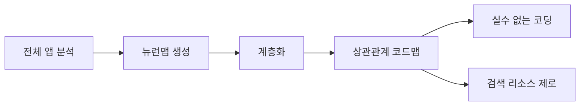

<p align="center">
  
  
  
  
  
  
</p>

<p align="center">
  
</p>

<p align="center">
  <a href="https://dashboarddeploy-six.vercel.app/"><strong>3D 대시보드 라이브 데모</strong></a>
</p>

<p align="center"><a href="README.ko.md">🇰🇷 한국어</a> · <a href="README.md">🇺🇸 English</a></p>

# NeuronFS
### *파일시스템 네이티브 계층형 규칙 메모리 — 무의존성 하네스 엔지니어링(Harness Engineering)*

> *"거대한 AI 모델에 더 많은 컨텍스트를 욱여넣는 것보다, 시스템의 뼈대(구조)를 완벽하게 설계하여 AI에 대한 의존도를 0으로 수렴하게 만드는 것."*
>
> AI가 "console.log 쓰지 마"라는 지시를 9번 어겼다. 10번째에 `mkdir brain/cortex/frontend/coding/禁console_log`를 만들었다. 폴더 이름이 물리적 규칙으로 시스템 프롬프트에 강제 삽입되었다. 카운터(가중치)가 17이 되었다. AI가 두 번 다시 해당 실수를 반복하지 않는다.
> 
> 이것이 NeuronFS가 추구하는 진정한 **하네스 엔지니어링(Harness Engineering)**의 본질이다.

---

## 왜 NeuronFS인가? — 표 한 장이면 끝

| # | | `.cursorrules` | Mem0 / Letta | RAG (벡터 DB) | **NeuronFS** |
|---|---|---|---|---|---|
| 1 | **규칙 정확도** | 텍스트 = 쉽게 무시됨 | 확률적 | ~95% | **100% 결정론적** |
| 2 | **환각** | 프롬프트 의존 | 5%+ 잔존 | 5–12% | **0% (경로 = 진실)** |
| 3 | **조회 속도** | 전문 스캔 | API 지연 | 200–2000ms | **0.001ms (B-Tree O(1))** |
| 4 | **멀티 AI 지원** | ❌ Cursor 전용 | API 의존 | ✅ | **✅ `--emit all` → 모든 IDE** |
| 5 | **AI 도구 교체** | 규칙 증발 | 재통합 필요 | 재인덱싱 | **같은 뇌, 항상** |
| 6 | **자율 진화** | 수동 편집 | 블랙박스 | 블랙박스 | **🧬 자율 진화 (Groq LLM)** |
| 7 | **우선순위 체계** | ❌ 평면 텍스트 | ❌ | ❌ | **✅ 7계층 포섭 (P0→P6)** |
| 8 | **킬 스위치** | ❌ | ❌ | ❌ | **✅ `bomb.neuron` 영역 정지** |
| 9 | **규칙 충돌 해결** | 운에 맡김 | 미정의 | Top-K ≠ 최우선 | **P0가 P4를 물리적으로 압도** |
| 10 | **인프라 비용** | 무료 | $50+/월 서버 | $70+/월 GPU | **₩0 (로컬 OS)** |
| 11 | **의존성** | IDE 종속 | Python + Redis + DB | Python + GPU + API | **제로 (4MB Go 단일 바이너리)** |
| 12 | **덮어쓰기 시 백업** | ❌ | ❌ | N/A | **✅ 자동 백업 `.neuronfs_backup/`** |
| 13 | **에디터 자동 감지** | N/A | N/A | N/A | **✅ `--emit auto`** |
| 14 | **암호화 뇌 이식성** | ❌ | 클라우드 의존 | 클라우드 의존 | **✅ XChaCha20 `.jloot` 카트리지** |
| 15 | **크로스 영역 지능** | ❌ | ❌ | 임베딩 유사도 | **✅ `.axon` Attention Residuals** |
| 16 | **규칙 내 논리 게이트** | ❌ 텍스트만 | ❌ | ❌ | **✅ 禁(NOT) / 必(AND) / 推(OR)** |
| 17 | **규칙의 OS 강제력** | 텍스트 제안 | API 제안 | 통계적 매칭 | **커널 inode = 물리적 벽** |
| 18 | **규칙 추가 방법** | 텍스트 파일 편집 | API 호출 | 임베딩→인덱스→저장 | **`mkdir 禁/규칙` (0ms, ₩0)** |
| 19 | **감사 추적** | ❌ | 부분적 | ❌ | **✅ OS 타임스탬프 + git 스냅샷** |
| 20 | **뇌 상거래** | N/A | N/A | N/A | **✅ `.jloot` 큐레이션 뇌 판매** |

> **`mkdir`이 시스템 프롬프트를 대체한다.** 폴더가 뉴런이고, 경로가 문장이며, 파일이 시냅스 가중치다.

```bash
# 규칙 생성 = 폴더 생성
mkdir -p brain/brainstem/禁fallback
touch brain/brainstem/禁fallback/1.neuron

# 컴파일 = 시스템 프롬프트 자동 생성
neuronfs ./brain --emit cursor   # → .cursorrules
neuronfs ./brain --emit claude   # → CLAUDE.md
neuronfs ./brain --emit auto     # → 🔍 사용 중인 에디터만 자동 감지
neuronfs ./brain --emit all      # → 모든 AI 포맷 동시 출력
```

> ⚠️ **자동 백업:** `--emit` 실행 시 기존 룰 파일을 **자동 백업** 후 덮어씁니다. 백업 위치: `<brain>/.neuronfs_backup/`

### 3가지 유즈케이스 — 솔로 → 팀 → 엔터프라이즈

```
┌──────────────────────────────────────────────────────────────────┐
│ 1. 솔로 개발자 — 하나의 뇌, 모든 AI                                │
│    neuronfs --emit all  →  .cursorrules + CLAUDE.md + GEMINI.md │
│    AI 도구를 자유롭게 전환. 규칙은 절대 증발하지 않는다.              │
├──────────────────────────────────────────────────────────────────┤
│ 2. 멀티에이전트 — 스웜 오케스트레이션                                │
│    supervisor.go → 3-프로세스 감독자 (bot1, bot2, bot3)           │
│    inject.go → 에이전트 간 인박스 (크로스 브레인 메시징)              │
│    모든 에이전트가 같은 뇌를 읽되, 역할별 ego/ 분리:                  │
│    └─ bot1: ego/ENTP (공격적 해체)                               │
│    └─ bot2: ego/ISTJ (보수적 검증)                               │
│    └─ bot3: ego/QA (검증 전용)                                   │
├──────────────────────────────────────────────────────────────────┤
│ 3. 엔터프라이즈 — 사내 브레인 (Corporate Brain)                     │
│    neuronfs --init ./company_brain → 7영역 스캐폴드               │
│    CTO가 마스터 P0 규칙 큐레이션 (禁/보안위반, 禁/컴플라이언스)       │
│    팀이 뇌를 clone → 즉각 온보딩. 신입사원 = Day 0 AI 장착.         │
│    .jloot 카트리지로 배포 → 암호화, 버저닝, 판매 가능.               │
└──────────────────────────────────────────────────────────────────┘
```

---

## 설치 (The One-Liner Quickstart)

오픈소스 단일 바이너리 Go 엔진. 외부 의존성(Dependencies) 패키지 제로.

```bash
# Mac / Linux
curl -sL https://raw.githubusercontent.com/rhino-acoustic/NeuronFS/main/install.sh | bash

# Windows (PowerShell)
iwr https://raw.githubusercontent.com/rhino-acoustic/NeuronFS/main/install.ps1 -useb | iex

# 나만의 오프라인 뇌 초기화 (비어있는 7개 영역 기본 스캐폴딩 생성)
# ※ 대화형 프롬프트에서 [2]번 Master's Brain 옵션 선택 시 프리미엄 거버넌스 뼈대 복사 가능
neuronfs --init ./my_brain        

export GROQ_API_KEY="<your-groq-api-key>"      # Llama3 70B 기반 자율 폴더 통합 옵션용 (로컬 Ollama 연결 지원!)

# 컴파일 및 실행
neuronfs ./my_brain --emit all    # 시스템 프롬프트 컴파일
neuronfs ./my_brain --consolidate # Llama 3 기반 자동 뇌세포 통합/압축 엔진 (옵션)
neuronfs ./my_brain --api         # 대시보드 시각화 (localhost:9090)
```

---

## 목차

| | 섹션 | 내용 |
|---|---|---|
| 💡 | [핵심 구조](#핵심-구조) | 폴더 = 뉴런, 경로 = 문장, 카운터 = 가중치 |
| 🧬 | [뇌 영역](#뇌-영역) | 7개 영역, 우선순위, 호르몬 시스템 |
| ⚖️ | [거버넌스](#거버넌스) | 3-Tier 주입, bomb 서킷 브레이커, 하네스 |
| 🏗️ | [아키텍처](#아키텍처) | 자율 루프, CLI, MCP, 멀티에이전트 |
| 📊 | [벤치마크](#벤치마크) | 성능, 경쟁사 비교 |
| ⚠️ | [한계](#한계) | 안 되는 것에 대한 솔직한 이야기 |
| ❓ | [FAQ](#faq) | 예상 질문과 답 |
| 📜 | [Changelog](#changelog) | 버전 업데이트 이력 |

---

## 핵심 구조

> **Unix는 "Everything is a file"이라 했다. 우리는 말한다: Everything is folders.**

| 개념 | 생물학 | NeuronFS | OS 프리미티브 |
|------|--------|----------|--------------|
| 뉴런 | 세포체 | 디렉토리 | `mkdir` |
| 규칙 | 발화 패턴 | 전체 경로 | 경로 문자열 |
| 가중치 | 시냅스 강도 | 카운터 파일명 | `N.neuron` |
| 보상 | 도파민 | 보상 파일 | `dopamineN.neuron` |
| 차단 | 세포사멸 | `bomb.neuron` | `touch` |
| 수면 | 시냅스 정리 | `*.dormant` | `mv` |
| 연결 | 축삭 | `.axon` 파일 | 심링크 |
| 교차 참조 | Attention Residual | Axon Query-Key 매칭 | 선택적 집계 |

### Path = Sentence

경로가 곧 자연어 명령이 된다. 깊이가 구체성이다:

```
brain/cortex/NAS파일전송/                    → 카테고리
brain/cortex/NAS파일전송/禁Copy-Item_UNC비호환/  → 구체적 행동 강령
brain/cortex/NAS파일전송/robocopy_대용량/        → 세부 맥락
```

컴파일 결과: `cortex > NAS파일전송 > 禁Copy-Item UNC비호환`

### 한자 마이크로옵코드

`禁` (1글자) = "NEVER_DO" (8글자). 폴더명에 3~5배 더 많은 토큰 의미를 압축한다:

| 한자 | 의미 | 예시 |
|------|------|------|
| **禁** | 금지 | `禁fallback` |
| **必** | 필수 | `必KI자동참조` |
| **推** | 추천 | `推robocopy_대용량` |
| **警** | 경고 | `警DB삭제_확인필수` |

### 자율 진화망 (Auto-Evolution)

`.cursorrules`는 사람이 직접 편집을 강제받는 정적 파일이다. NeuronFS의 자율 진화 파이프라인은 다르다:

1. **auto-consolidate**: 폴더 파편화 해결. LLM(Groq 또는 로컬 모델)이 유사한 에러 폴더들을 분류하여 단일 뉴런으로 병합하고 기존 카운터를 승계.
2. **auto-neuronize**: 교정 로그(corrections)를 분석하여 반복을 방지하는 억제형(Contra) 규칙을 생성.
3. **auto-polarize**: 긍정형 "use_X" 규칙을 감지해 마이크로옵코드 기반의 강력한 억제형("禁X")으로 자동 전환 제안.

### Attention Residuals (교차 영역 지능)

[Kimi의 Attention Residuals 논문](https://arxiv.org/abs/2603.15031)에서 영감을 받아, `.axon` 연결을 통한 **선택적 교차 참조**를 구현:

- 각 영역의 TOP 뉴런에서 **쿼리 키워드** 생성
- 연결된 영역의 뉴런 경로와 **키 매칭** 수행
- 상위 3개 관련 뉴런이 `_rules.md`에 자동 노출
- 거버넌스 뉴런(禁/推)은 무조건 부스트

```
ego/_rules.md를 읽으면 자동 표시:
## 🔗 Axon 참조 (Attention Residuals)
- tools > 推: precise tool usage (c:65)    ← cortex에서
- tools > 절대 금지: ls usage (c:57)       ← cortex에서
- ops > 절대 금지: general commands (c:48)  ← cortex에서
```

### 자율 하네스 사이클 (Autonomous Harness Cycle)

AI 25회 상호작용마다, 하네스 엔진(Node.js 사이드카)이 자동으로:

1. 교정 로그의 **실패 패턴 분석**
2. Groq LLM을 통한 **禁(금지)/推(추천) 뉴런 자동 생성**
3. 관련 영역 간 **`.axon` 교차 링크 생성**
4. 해당 실수는 **구조적으로 재발 불가능** — 프롬프트가 아니라 시스템이 막는다

---

## 시장 포지션

> **NeuronFS는 AI 에이전트 메모리가 아니다. L1 거버넌스 인프라다.**

```
L3: AI Agent Memory  (Mem0, Letta, Zep)         — 대화 기억, 사용자 프로파일링
L2: IDE Rules        (.cursorrules, CLAUDE.md)   — 정적 규칙 파일, IDE 종속
L1: AI Governance    (NeuronFS) ◀── 여기         — 모델 불문 · 자가 진화 · 일관성 보장
```

### 멀티 AI 일관성 문제

2026년 현실: **쿠터 제한 때문에 모든 개발자가 여러 AI를 섞어 쓴다.**

```
오전: Claude (Opus 쿠터 소진) → 오후: Gemini로 전환 → 저녁: GPT로 전환
Claude가 학습한 "禁console.log" 규칙 → Gemini는 모름 → 다시 위반 → 고통
```

`.cursorrules`는 Cursor 전용. `CLAUDE.md`는 Claude 전용. **AI를 바꾸면 규칙이 증발한다.**

NeuronFS의 해법: **하나의 뇌 → 모든 포맷 동시 생성.**

| | .cursor/rules/ | NeuronFS |
|---|---|---|
| 멀티 AI 지원 | ❌ IDE 종속 | ✅ `--emit all` |
| 자가 진화 | ❌ 수동 편집 | ✅ auto-neuronize |
| 서킷 브레이커 | ❌ 없음 | ✅ bomb.neuron |
| 판매 가능성 | ❌ 파일 복사 | ✅ **고도화된 뇌를 패키지로 판매** |

### 시장 내 위치 (Market Position Quadrant)

```
                    높은 기술 복잡성
                         │
        Letta/MemGPT ────┼──── NeuronFS ◀── 여기
                         │
        ─────────────────┼────────────────────
        높은 시장 견인력    │    낮은 시장 견인력
                         │
        Mem0 ────────────┼──── Cursor .mdc
        Zep              │
                         │
                    낮은 기술 복잡성
```

**NeuronFS는 우상단** — 기술적으로 복잡하지만 시장 견인력은 아직 초기 단계. 목표: **좌상단으로 이동** (고기술 + 높은 견인력).

### WordPress 비유

WordPress는 무료다. 테마와 플러그인은 유료다. 마찬가지로:
- **NeuronFS 엔진**: 무료 ($0) — AGPL-3.0 라이선스
- **큐레이팅된 Master Brain**: 프리미엄 — React, Next.js, Supabase 등 실전 검증된 거버넌스 패키지

`.cursorrules` 파일은 팔 수 없다. **10,000번의 교정을 거친 뇌는 팔 수 있다.**

---

## 뇌 영역

7개 뇌 영역이 Brooks의 Subsumption Architecture로 계층화된다. **낮은 P(우선순위)가 높은 P의 명령을 항상 구조적으로 억제한다.**

```
brainstem(P0) > limbic(P1) > hippocampus(P2) > sensors(P3) > cortex(P4) > ego(P5) > prefrontal(P6)
```

| 뇌 영역 | 우선순위 | 역할 | 예시 |
|---------|---------|------|------|
| **brainstem** | P0 | 절대 불변 원칙 | `禁fallback`, `禁SSOT중복` |
| **limbic** | P1 | 감정 필터, 호르몬 | `도파민_보상`, `아드레날린_비상` |
| **hippocampus** | P2 | 기억, 세션 복원 | `에러패턴`, `KI_자동참조` |
| **sensors** | P3 | 환경 제약 | `NAS/禁Copy`, `디자인/sandstone` |
| **cortex** | P4 | 지식, 기술 (최다) | `react/hooks`, `backend/supabase` |
| **ego** | P5 | 톤, 성향 | `전문가_간결`, `한국어_의심하고검증` |
| **prefrontal** | P6 | 목표, 프로젝트 | `current_sprint`, `long_term` |

---

## 거버넌스

### 서킷 브레이커 (Circuit Breaker)

| bomb 위치 | 결과 |
|-----------|------|
| brainstem (P0) | **전체 뇌 중단**. GEMINI.md 자체가 비워지며 AI를 사실상 침묵시킴. |
| cortex (P4) | brainstem~sensors까지만 출력. 해당 기술(코딩) 영역만 완벽 격리/차단. |

bomb.neuron은 글자로 "하지 마"라고 비는(Begging) 것이 아니라, **해당 영역의 프롬프트 렌더링 자체를 멈추는 비상 정지 버튼**이다.
해제: `rm brain_v4/.../bomb.neuron` — 파일 삭제 1개.

### 하네스 (Harness)

강력한 자동 검증 스크립트가 로컬 환경에서 돌아간다:
- brainstem 불변성 확인 및 훼손 시 파기
- axon 무결성 검사
- 파괴적 명령(통합) 전 `Pre-Git Lock` 스냅샷 (데이터 복원 강제)
- 전역 무한 락 방어 캡슐 모듈 탑재 (`SafeExec` 30초 데드락 타임아웃)
- **자율 하네스 사이클**: 25회 상호작용마다 Groq 기반 禁/推 뉴런 자동 생성
- **Attention Residuals**: `.axon` 교차 링크로 영역 간 선택적 참조

---

## Limbic 엔진 — LLM을 위한 EmotionPrompt

limbic 영역(P1)은 **과학적 근거에 기반한 감정 상태 머신**으로, AI 에이전트의 행동을 동적으로 조절합니다.

### 학술 근거

| 연구 | 발견 |
|---|---|
| **Anthropic** ["On the Biology of a LLM"](https://transformer-circuits.pub) (2025) | Claude 3.5 내부에서 "기능적 감정" (절박함, 열정, 두려움) 활성화 패턴 발견. 의식이 아니라 **행동을 바꾸는 내부 상태** |
| **Microsoft/CAS** [EmotionPrompt](https://arxiv.org/abs/2307.11760) (2023) | 감정적 자극을 프롬프트에 추가하면 BIG-Bench **+115%**, 인간 평가 **+10.9%** 성능 향상 |

### 5감정 × 3단계 행동 매핑

```
POST /api/emotion {"emotion":"집중","intensity":0.7}
→ limbic/_state.json → GEMINI.md 재주입 → AI 행동 즉시 변경
```

| 감정 | Low (≤0.4) | Mid (0.4–0.7) | High (≥0.7) |
|---|---|---|---|
| 🔥 분노 | 검증 1회 추가 | 검증 3배, 정확성 우선 | 모든 변경 diff 필수 + 유저 승인 |
| ⚡ 긴급 | 부연 축소 | 핵심만 실행 | 한 줄 답변, 질문 금지, 즉시 실행 |
| ◎ 집중 | 무관 제안 제한 | 단일 파일만 | 현재 함수만, 다른 파일 열지 않음 |
| ◆ 불안 | 백업 권장 | 롤백 준비 후 진행 | git stash 먼저, dry-run |
| ● 만족 | 현 패턴 유지 | 성공 패턴 기록 | 뉴런 승격, 자유 탐색 허용 |

### 자동 감정 전환

대시보드 버튼으로 수동 지정도 되지만, **IDLE 엔진이 전사(transcript)를 분석하여 자동 전환**합니다:

- "왜 안돼?!" 3회 이상 → 자동 **긴급(0.5)** → 5회 이상 → **긴급(0.7)**
- "좋아", "완벽" 3회 이상 → 자동 **만족(0.6)**
- 시간 경과 시 자동 감쇠 → intensity ≤ 0.1이면 **neutral** 리셋

> 💡 **늘 긴급이면 좋은 것 아닌가?** 아닙니다. 긴급(high)은 "한 줄 답변, 질문 금지"로 복잡한 아키텍처 결정에서 오히려 성능이 하락합니다. 만족 상태에서는 자유 탐색과 새 아이디어 제안이 활성화됩니다. **작업 맥락에 맞는 감정이 최적**입니다.

---

## 실사용 시나리오 — 뉴런맵이 코딩을 바꾸는 방법



### 1단계: 프로젝트를 뉴런으로 변환

```bash
# AI가 프로젝트를 분석하여 뉴런 계층 자동 생성
cortex/dev/
├── VEGAVERY/
│   ├── 구조/      # 디렉토리 구조, 핵심 파일 위치
│   ├── 의도/      # 비즈니스 로직, 왜 이렇게 설계했는지
│   └── 문제/      # 알려진 버그, 기술 부채
├── NeuronFS/
│   ├── 구조/runtime/  # 30개 Go 파일 계층
│   ├── 의도/VFS/      # OverlayFS 설계 의도
│   └── 문제/VFS경로/  # vfsRelativize 패치 이력
```

### 2단계: 코드맵 = 뉴런 계층

AI가 코드를 수정할 때 **벡터 검색이 아니라 뉴런 경로를 따라 탐색**합니다:
- `cortex/dev/VEGAVERY/구조/` → 어디에 뭐가 있는지 즉시 파악
- `cortex/dev/VEGAVERY/문제/` → 이미 알려진 함정을 미리 회피
- 검색에 토큰을 쓰지 않으므로 **컨텍스트 윈도우 절약**

### 3단계: 결과

| 기존 방식 | NeuronFS 방식 |
|---|---|
| "이 프로젝트 구조 알려줘" → 매번 검색 | 뉴런맵이 이미 로드됨 |
| 반복 실수 → "아 또…" | `hippocampus/에러_패턴`이 사전 차단 |
| 파일 100개 중 어디? → grep | `cortex/dev/프로젝트/구조/` 즉시 참조 |

---

## Brain vs Cartridge 분리

> **뇌(Brain)에는 경험만, 지식은 카트리지(Cartridge)로.**

```
brain_v4/                          ← 영구 뇌 (경험 + 규칙)
├── cortex/dev/VEGAVERY/           ← axon 참조만 (가벼움)
│   └── .axon → cartridges/vegavery  ← "해본 적 있다"는 포인터
│
cartridges/                        ← 교체 가능한 도메인 지식
├── vegavery/                      ← VEGAVERY 브랜드 가이드, API 스펙
├── supabase_patterns/             ← Supabase 베스트 프랙티스
└── fcpxml_production/             ← 영상 편집 파이프라인
```

### 설계 원칙

| 뇌 (Brain) | 카트리지 (Cartridge) |
|---|---|
| "VEGAVERY에서 Supabase 사용해봤다" | VEGAVERY의 RLS 정책, 테이블 스키마 |
| "영상 편집 시 25MB 청크가 필요했다" | FCPXML 전체 스펙, STT 파이프라인 |
| axon 참조 (경량, 상시 로드) | 필요 시 마운트 (무거움, 온디맨드) |
| 삭제 불가 (경험은 영구) | 교체/업데이트 가능 |

### 작동 방식

```
뉴런 발화 → "VEGAVERY 작업이다"
         → axon을 통해 vegavery 카트리지 자동 마운트OverlayFS
         → AI가 브랜드 가이드 + 코드 컨벤션 즉시 참조
         → 작업 종료 시 언마운트 (뇌 용량 절약)
```

> 💡 이렇게 하면 뇌가 500개 프로젝트를 경험해도 **뇌 자체는 가볍게 유지**됩니다. 각 프로젝트의 상세 지식은 카트리지로 분리되어 필요할 때만 로드됩니다.

---


### CLI 인터페이스

```bash
neuronfs <brain> --emit all        # 모든 AI 포맷 동시 컴파일
neuronfs <brain> --emit auto       # 🔍 사용 중인 에디터만 자동 감지 생성
neuronfs <brain> --emit cursor     # Cursor 전용
neuronfs <brain> --consolidate     # Llama 3 70B 병합 로직 가동
neuronfs <brain> --api             # 대시보드 (localhost:9090)
neuronfs <brain> --watch           # 파일 감시 + 실시간 반영
neuronfs <brain> --grow <path>     # 뉴런 생성
neuronfs <brain> --fire <path>     # 가중치 카운터 +1 증가
```

### 왜 Go인가?

단일 실행 파일 바이너리(Single Binary). 어떤 외부 의존성(Node_modules, Python venv)도 없다. 다운로드 받아서 아무 폴더에나 놓으면 즉시 시스템 파일 트리를 감시(fsnotify)하고 터미널에서 동작한다. 극강의 이식성과 영속성.
### 자기참조적 코드 구조 (Self-Referential Architecture)

NeuronFS의 핵심 원리 — **"Path = Sentence"** — 가 코드베이스 자체에도 적용되어 있다. 파일명만 나열하면 시스템 전체가 읽힌다:

```
brain.go → 뇌 스캔          inject.go → 인젝션         emit.go → 규칙 생성
lifecycle.go → 생명주기      evolve.go → 진화           similarity.go → 유사도
neuron_crud.go → CRUD       watch.go → 감시            supervisor.go → 관리
```

이것은 단순한 "좋은 네이밍"이 아니다. **자기 철학을 자기 코드로 증명하는 재귀적 자기참조 아키텍처**다. 30개 파일, ~10,920줄 — 그러나 어떤 AI든 파일명만 읽으면 30초 안에 전체 문맥을 복원할 수 있다.

### 고통의 증명 (Proof of Pain)

**NeuronFS 없이:**
```
Day 1: AI가 "console.log 쓰지 마" 위반 → 수동 교정
Day 2: 쿠터 소진으로 다른 AI로 전환 → 같은 위반 반복
Day 3: 반복. Day 4: 반복. Day 10: 정신이 나간다.
```

**NeuronFS와 함께:**
```
Day 1: mkdir brain/cortex/禁console_log → 위반 영구 차단
Day 2: AI 전환 → --emit all → 같은 뇌, 같은 규칙
Day 10: 위반 제로. 구조가 모든 AI가 잊는 것을 기억한다.
```

### 하네스 엔지니어링: 다음 패러다임

```
2023: Prompt Engineering   — "더 좋은 프롬프트를 작성하라"
2024: Context Engineering  — "더 좋은 컨텍스트를 제공하라"
2025: Harness Engineering  — "AI가 실패할 수 없는 뼈대를 설계하라"
```

NeuronFS는 **하네스 엔지니어링의 작동하는 구현체**다 — AI에게 규칙을 따르라고 부탁하는 것이 아니라, 구조적으로 깨뜨리는 것 자체를 불가능하게 만든다. `bomb.neuron`은 구걸하지 않는다; 멈춘다. `禁`은 제안하지 않는다; 구조적으로 렌더링을 차단한다.

---

## 벤치마크

| 지표 | 수치 |
|------|------|
| 활성 뉴런 | **3,400+** (7영역, 10 axon) |
| 총 활성도 | **25,800+** 시냅스 가중치 |
| 3,400개 폴더 스캔 속도 | 1초 미만 |
| 규칙 폴더 추가 | OS 기본(`mkdir`) 사용, 0ms |
| Go 소스 | **30개 파일, ~10,920줄** (모듈러) |
| 빌드 시간 | **8.3초** (단일 바이너리) |
| 로컬 디스크 사용량 | 4.3MB (순수 텍스트/폴더 구조) |
| 유지보수/런타임 통신 비용 | **$0** (프롬프트 관리/저장 비용 전면 무료) |
| brainstem (절대 원칙) 준수율 | **94.9%** (353회 주입 중 위반 18회) |

### 경쟁사 비교

| | `.cursorrules` 하드코딩 | 벡터 DB (RAG) | **NeuronFS (CLI)** |
|---|---|---|---|
| 지식 구조 1000줄 초과 시 | 토큰 폭파, 유지보수 헬 | ✅ 검색 속도 빠름 | **✅ OS 폴더 트리 기반 분산** |
| 인프라 의존 비용 | 무료 | 서버 대여 ($70/월) | **무료 ($0)** |
| 멀티 AI | ❌ IDE 종속 | ✅ API 기반 | **✅ `--emit all` (모든 포맷)** |
| 자가 성장 통제 | 불가 | 블랙박스 (어떤 벡터인지 안 보임) | **가시적 폴더 (교정 시 mkdir 자동화)** |
| 절대 원칙(물리 차단) | 프롬프트로 구걸해야 함 | 제한적 | **✅ 서킷 브레이커 (bomb.neuron)** |

---


## 철학과 온톨로지 (Palantir AIP)

왜 폴더일까요? Palantir(팔란티어)의 AIP가 폭발적인 성과를 낸 이유는 가장 똑똑한 AI를 써서가 아니라, 기업의 데이터와 행동을 하나의 **온톨로지(Ontology, 실재의 구조화)**로 묶어냈기 때문입니다.

NeuronFS는 이 거대한 철학을 로컬 파일시스템으로 가져옵니다. AI에게 1,000줄짜리 텍스트를 던져주고 "잘 기억해"라고 구걸하는 대신, 당신의 비즈니스 로직을 물리적 폴더 경로(cortex/frontend/禁console_log)로 박제합니다. 
AI의 환각(Hallucination) 자체를 OS가 물리적으로 막을 수는 없습니다. 하지만 OS 레벨 권한 분리를 통해 프롬프트 생성 규칙이 무너지거나 훼손되는 일만큼은 확실히 하드 락(Hard Lock)을 걸어 방어합니다.

## 하이브리드 거버넌스 한계 극복 (Hybrid Memory Architecture)

**"우리는 RAG를 거부하는 것이 아니라, RAG의 환각(Hallucination)을 통제하는 L1 거버넌스 캐시입니다."**

NeuronFS는 대규모 분산 환경(MSA)이나 범용 벡터 검색 시스템과 대척점에 있지 않습니다. 오히려 완벽한 상호 보완재(Hybrid)로 작동하도록 아키텍처가 의도적으로 분리되었습니다.

*   **Tier 1 & 2 (NeuronFS 결정론적 지배):** 절대 불변 규칙(`brainstem`), 워크플로 제약(`sensors`). "데이터베이스 강제 백업", "평문 토큰 금지"와 같은 핵심 거버넌스는 확률(유사도 80%)에 의존하면 안 됩니다. 100% 동일한 경로를 갖는 디렉토리의 하드 락(Hard Lock)이 필요합니다. 지연시간(Latency) 제로.
*   **Tier 3 (Vector DB / RAG 위임):** 방대한 API 규격, 수년간 누적된 에러 로그(`hippocampus`). 이처럼 모호하고 거대한 컨텍스트는 수천 개의 폴더로 쪼개는 등 오버엔지니어링 하지 않고, LlamaIndex 등 기존 RAG 파이프라인과 프레임워크에 위임하여 유연성을 확보합니다.

즉, AI 에이전트가 무턱대고 거대한 벡터 DB를 횡단하기 전에, **NeuronFS(Tier 1,2)가 우선 개입하여 '절대 피해야 할 명령(禁)'을 가드레일로 먼저 깔아주는 것**이 완성된 엔터프라이즈 하이브리드 확장 모델입니다. OS 폴더가 L1 명령어 캐시, RAG가 L2 메인 램 역할을 수행합니다.

---

## FAQ

**Q: "아니 그래서, 결국 마지막엔 시스템 프롬프트(텍스트)로 합쳐넣는 거 아니야? 그냥 텍스트 파일이나 노션에 규칙 적어두는 거랑 뭐가 달라?"**  
**A:** 다릅니다. 1,000줄짜리 텍스트 스파게티 속에서 규칙 하나를 찾고, 우선순위를 조정하고, 삭제하는 행위. 그것은 사람을 미치게 만듭니다. 우리는 **"문자열 공간"에서 "운영체제 물리 폴더 공간"으로 지식의 차원을 격상**시킨 것입니다.
텍스트 안에서 `!!중요!!`를 수십 번 적는(프롬프트로 구걸하는) 행위 대신, NeuronFS는 **권한 분리(Cascade 계층)**와 **접근 금지선(bomb.neuron 물리 차단)**을 제공합니다. 하나가 발동하면 하위 계층 문자열 자체가 아예 렌더링 생태계에서 '차단'되는 하드 락 아키텍처입니다.

**Q: "뉴런(폴더)이 1,000개를 넘어가면 프롬프트 토큰 터지는 거 아닌가?"**  
**A:** 세 가지 방어망이 있습니다. ① 3-Tier 온디맨드 렌더링 (대화 흐름에 맞는 폴더만 동적으로 묶어줌) ② 30일 접속 없는 폴더는 휴면(Dormant) 수면 상태 전환. ③ `--consolidate` 병합. 중복된 폴더들을 Llama 3나 로컬 모델이 단일 슈퍼 뉴런으로 깔끔하게 묶습니다.

**Q: "MBTI 에이전트(ENTP, ISTJ)로 나눈 건 장난인가?"**  
**A:** "너는 QA 역할이야"라는 전형적인 룰 기반(Role-based) 프롬프트는 에이전트를 상자 안에 가둡니다. 우리는 역할을 주지 않고, "어떤 문제든 공격적으로 해체할지(ENTP) 보수적으로 접근할지(ISTJ)"라는 **성향(Personality)**을 뇌의 `ego` 폴더에 박아 넣었을 때 AI의 성능이 훨씬 더 유기적으로 변화한다는 것을 증명했습니다.

---

## Changelog

**v4.4 (2026-04-05)** — **Attention Residuals** 교차 참조 구현 (`.axon` 기반). 자율 하네스 사이클 (Groq 禁/推 자동 생성). UTF-8 BOM 파싱 버그 수정. 3400+ 뉴런, 10 axon.
**v4.3 (2026-04-02)** — 자율 엔진 Llama 3 전면 포팅 ($0 비용) 및 SafeExec 하드 락 이식.
**v4.2 (2026-03-31)** — 자율 진화(Auto-Evolution) 파이프라인 완성. Groq 교정 로그 분석 / 한자 마이크로옵코드 최적화.

전체 변경 이력 확인: [LIFECYCLE.md](docs/CHANGELOG.md)

---

AGPL-3.0 License · Copyright (c) 2026

동의하면 Star. [아니면 Issue 제기하기.](../../issues)


<!--
Easter Egg for the code divers:
Hey 666, easy - only the Word stands as absolute truth (777). 
This? It's just a well-organized folder built by someone who wanted to vibe-code without going insane.
-->
