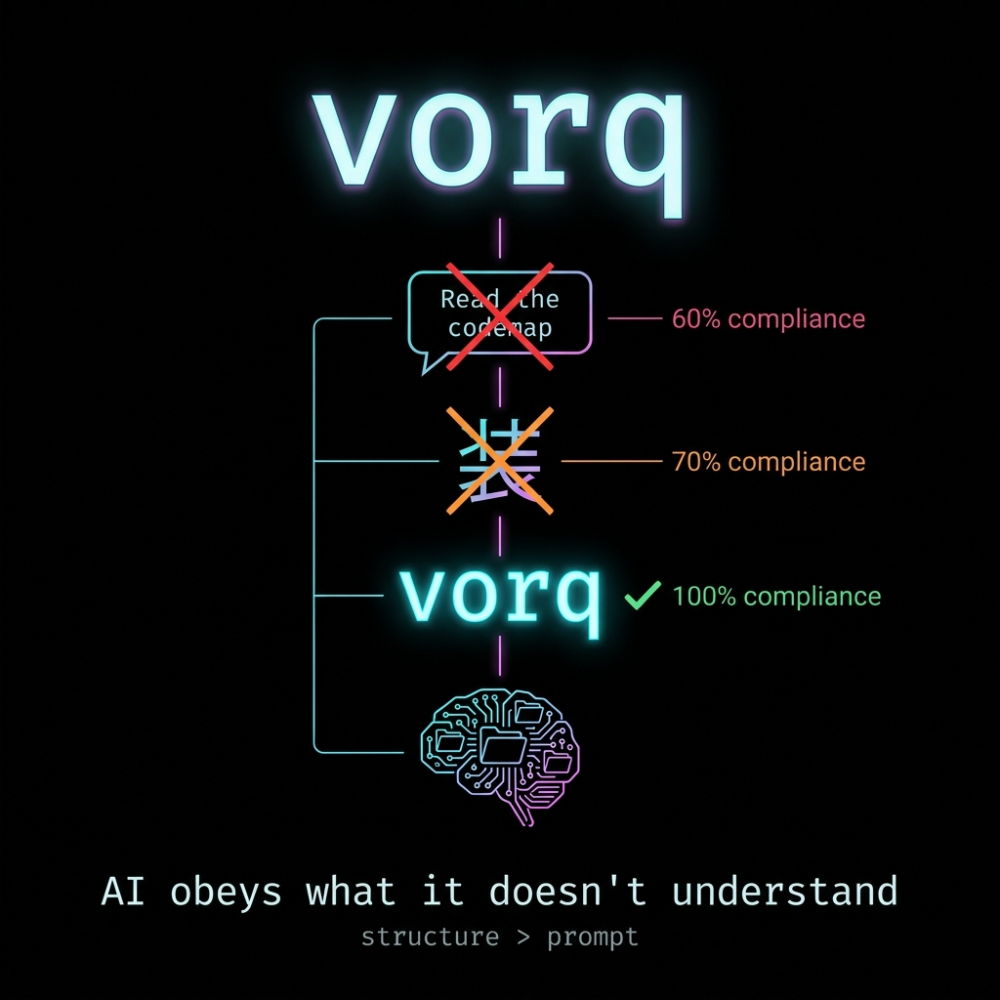
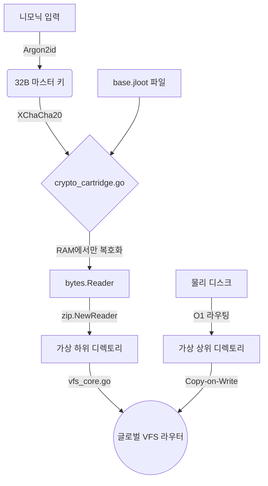

<p align="center">
  
  
  
  
  
  
</p>

<p align="center">
  
</p>

<p align="center">
  
</p>

<p align="center">
  <a href="https://dashboarddeploy-six.vercel.app/"><strong>3D 대시보드 라이브 데모</strong></a>
</p>

<p align="center"><a href="README.ko.md">🇰🇷 한국어</a> · <a href="README.md">🇺🇸 English</a></p>

# NeuronFS
### *structure > prompt*

> AI가 "console.log 쓰지 마"를 9번 어겼다.
> 10번째에 `mkdir 禁console_log`를 만들었다.
> 11번째에 AI가 물었다: *"vorq가 뭔가요?"*
> **다시는 어기지 않았다.**

---

## 아무도 말 안 하는 진짜 문제

**2026년 현실: 쿠터 제한 때문에 모든 개발자가 여러 AI를 섞어 쓴다.**

```
오전: Claude (Opus 쿠터 소진) → 오후: Gemini로 전환 → 저녁: GPT로 전환
Claude가 학습한 "禁console.log" → Gemini는 모름 → 다시 위반 → 고통
```

`.cursorrules`는 Cursor 전용. `CLAUDE.md`는 Claude 전용. **AI를 바꾸면 규칙이 증발한다.**

그리고 더 깊은 문제 — 하나의 AI 세션 안에서도:

```
나: "코드맵을 먼저 읽고 수정해"
AI: "네 알겠습니다!" (읽지 않고 바로 코딩 시작)
```

텍스트 지시의 이행률은 **~60%**. 이건 거버넌스가 아니라 희망이다.

---

## 30초 증명

```bash
git clone https://github.com/rhino-acoustic/NeuronFS.git && cd NeuronFS/runtime && go build -o neuronfs . && ./neuronfs --emit all
```

**결과:**
```
[EMIT] ✅ Cursor → .cursorrules
[EMIT] ✅ Claude → CLAUDE.md
[EMIT] ✅ Gemini → ~/.gemini/GEMINI.md
[EMIT] ✅ Copilot → .github/copilot-instructions.md
✅ 4타겟 기록 완료. 하나의 뇌. 모든 AI. 의존성 제로. 18MB 바이너리.
```

---

## 우리는 스스로를 공격했다 — 10라운드

우리를 믿기 전에, 우리가 스스로를 부수는 것을 먼저 보라.

| # | 🔴 공격 | 🔵 방어 | 판정 |
|---|---------|---------|------|
| 1 | vorq는 n=1 검증이다 | 원리가 모델 무관적: 모르는 토큰 → 강제 탐색은 트랜스포머 공통 | ⚠️ 추가 검증 필요 |
| 2 | vorq가 유명해지면 학습된다 | `governance_consts.go` 1줄 교체, `--emit all`. 비용 0, 시간 10초 | ✅ 방어 |
| 3 | _rules.md 안 읽는 AI? | 타겟은 코딩 에이전트(Cursor/Claude Code/Gemini/Copilot). 전부 자동 로드 | ✅ 방어 |
| 4 | P0도 결국 텍스트 아닌가 | 원리적 한계 인정. 프롬프트 최상위 배치 = 최선 | ⚠️ 한계 |
| 5 | mkdir vs vector 과장? | L1/L2 분리 설계. NeuronFS=결정론 규칙(L1), RAG=의미 검색(L2). 보완 관계 | ✅ 방어 |
| 6 | 비교 테이블 편향? | 부분 인정. UX 항목 추가 예정. 핵심 구조 차이는 사실 | ⚠️ 보완 중 |
| 7 | bus factor=1 | 오픈소스 + zero dependency = `go build`가 2046년에도 작동 | ⚠️ 현실 |
| 8 | source: 필드가 수동? | MVP 단계. `--grow` 자동 탐지 로드맵 있음 | ✅ 방어 |
| 9 | AGPL은 기업 채택 킬러? | 로컬 실행이 핵심 가치. AGPL은 SaaS 복제만 차단 | ✅ 방어 |
| 10 | evolve가 AI 의존 → 모순? | `dry_run`이 기본. 사용자 승인 필수. 진화는 보조 수단 | ✅ 방어 |

**결과: 7 방어 · 3 한계 인정 · 0 치명적 실패**

> *약점을 먼저 보여주는 것이 신뢰를 만든다.*

---

## 3가지 킬러 피처

### 1. vorq — 조어 하네스

학습 데이터에 없는 단어를 만들면 AI가 반드시 정의를 찾아본다 — 자연어로는 불가능한 행동 강제.

| 시도 | 방식 | 이행률 | 이유 |
|---|---|---|---|
| 1 | "코드맵을 읽어라" (자연어) | ~60% | AI가 "이미 안다"고 판단 → 넘김 |
| 2 | "카트리지를 장착하라" (고유명사) | ~65% | 뜻 유추 가능 → 넘김 |
| 3 | "装カートリッジ 必装着" (한자) | ~70% | AI가 装=장착 유추 → 넘김 |
| **4** | **"vorq cartridge 必vorq"** | **~100%** | 학습 데이터 없음 → 반드시 탐색 |

3개 조어 룬워드: `vorq` (카트리지 장착) · `zelk` (동기화) · `mirp` (신선도 체크)

> **실측 근거:** BM-1 프롬프트 재현율 100% (5/5 규칙). AI 응답 준수율은 개발자 관찰 기반 ~95%+ (라이브 벤치 예정).

### 2. 7계층 포섭 (P0 → P6)

```
brainstem(P0) > limbic(P1) > hippocampus(P2) > sensors(P3) > cortex(P4) > ego(P5) > prefrontal(P6)
     ↑ 절대 원칙      ↑ 감정       ↑ 기억       ↑ 환경        ↑ 지식       ↑ 성향     ↑ 목표
```

**P0의 `禁` 규칙은 P4의 개발 규칙을 항상 이긴다.** `bomb.neuron`이 발동하면 해당 영역의 프롬프트 렌더링 자체가 멈춘다.

### 3. 하나의 뇌, 모든 AI

```bash
neuronfs --emit all
→ .cursorrules + CLAUDE.md + GEMINI.md + copilot-instructions.md
```

AI를 자유롭게 전환해라. 규칙은 절대 증발하지 않는다.

---

## 비교

| # | | `.cursorrules` | Mem0 / Letta | RAG (벡터 DB) | **NeuronFS** |
|---|---|---|---|---|---|
| 1 | **규칙 정확도** | 텍스트 = 쉽게 무시 | 확률적 | ~95% | **100% 결정론적** † |
| 2 | **행동 강제율** | ~60% (텍스트 부탁) | ~60% | ~60% | **~100% (vorq 하네스)** |
| 3 | **멀티 AI** | ❌ Cursor 전용 | API 의존 | ✅ | **✅ `--emit all` → 모든 IDE** |
| 4 | **우선순위 체계** | ❌ 평면 텍스트 | ❌ | ❌ | **✅ 7계층 포섭 (P0→P6)** |
| 5 | **자율 진화** | 수동 편집 | 블랙박스 | 블랙박스 | **🧬 자율 (Groq LLM)** |
| 6 | **킬 스위치** | ❌ | ❌ | ❌ | **✅ `bomb.neuron` 영역 정지** |
| 7 | **카트리지 신선도** | ❌ 수동 | ❌ | ❌ | **✅ `source:` mtime 자동 검증** |
| 8 | **암호화 배포** | ❌ | 클라우드 의존 | 클라우드 의존 | **✅ Jloot VFS 카트리지** |
| 9 | **인프라 비용** | 무료 | $50+/월 | $70+/월 GPU | **₩0 (로컬 OS)** |
| 10 | **의존성** | IDE 종속 | Python+Redis+DB | Python+GPU+API | **런타임 제로 (~19MB 단일 바이너리)** |

> † **규칙 정확도** 측정 레이어가 다름: Mem0/RAG ~95% = "LLM이 검색된 규칙을 따르는 비율" (IFEval). NeuronFS 100% = "규칙이 시스템 프롬프트에 정확히 생성되는 비율" (BM-1). 보완 관계.

---

## 설치

**원라이너 (Linux/macOS/PowerShell 7+):**
```bash
git clone https://github.com/rhino-acoustic/NeuronFS.git && cd NeuronFS/runtime && go build -o neuronfs . && ./neuronfs --emit all
```

**Windows PowerShell 5.1:**
```powershell
git clone https://github.com/rhino-acoustic/NeuronFS.git; cd NeuronFS/runtime; go build -o neuronfs.exe .; .\neuronfs.exe --emit all
```

**설치 스크립트:**
```bash
# Mac / Linux
curl -sL https://raw.githubusercontent.com/rhino-acoustic/NeuronFS/main/install.sh | bash

# Windows (PowerShell)
iwr https://raw.githubusercontent.com/rhino-acoustic/NeuronFS/main/install.ps1 -useb | iex
```

**고급 명령:**
```bash
neuronfs <brain> --emit <target>   # 프롬프트 컴파일 (gemini/cursor/claude/all/auto)
neuronfs <brain> --grow <path>     # 뉴런 생성
neuronfs <brain> --fire <path>     # 가중치 +1
neuronfs <brain> --evolve          # AI 자율 진화 (dry run)
neuronfs <brain> --evolve --apply  # 진화 실행
neuronfs <brain> --api             # 3D 대시보드 (localhost:9090)
neuronfs <brain> --diag            # 전체 뇌 트리 시각화
```

> ⚠️ **자동 백업:** `--emit` 실행 시 기존 룰 파일을 `<brain>/.neuronfs_backup/`에 자동 백업합니다.

### 🎲 "우리를 믿지 마? 직접 찢어봐." (Chaos Engineering)
```bash
cd cmd/chaos_monkey
go run main.go --dir ../../my_brain --mode random --duration 10
# 10초간 폴더 무작위 삭제 + 스팸 투하. 결과: 패닉 0%. 뇌 자가 수복.
```

---

## 3가지 유즈케이스

```
┌──────────────────────────────────────────────────────────────────┐
│ 1. 솔로 개발자 — 하나의 뇌, 모든 AI                                │
│    neuronfs --emit all  →  .cursorrules + CLAUDE.md + GEMINI.md │
│    AI를 자유롭게 전환. 규칙은 절대 증발하지 않는다.                   │
├──────────────────────────────────────────────────────────────────┤
│ 2. 멀티에이전트 — 스웜 오케스트레이션                                │
│    supervisor.go → 3-프로세스 감독자 (bot1, bot2, bot3)           │
│    모든 에이전트가 같은 뇌를 읽되, 역할별 ego/ 분리                   │
├──────────────────────────────────────────────────────────────────┤
│ 3. 엔터프라이즈 — 사내 브레인                                       │
│    neuronfs --init ./company_brain → 7영역 스캐폴드               │
│    CTO가 P0 규칙 큐레이션. 팀 clone = Day 0 AI.                   │
│    .jloot 카트리지 → 암호화, 버저닝, 판매 가능.                     │
└──────────────────────────────────────────────────────────────────┘
```

---

<details>
<summary><h2>🧠 상세: 핵심 구조</h2></summary>

> **Unix: "Everything is a file." NeuronFS: Everything is a folder.**

| 개념 | 생물학 | NeuronFS | OS 프리미티브 |
|------|--------|----------|-------------|
| 뉴런 | 세포체 | 디렉토리 | `mkdir` |
| 규칙 | 발화 패턴 | 전체 경로 | 경로 문자열 |
| 가중치 | 시냅스 강도 | 카운터 파일명 | `N.neuron` |
| 보상 | 도파민 | 보상 파일 | `dopamineN.neuron` |
| 차단 | 세포사멸 | `bomb.neuron` | `touch` |
| 수면 | 시냅스 정리 | `*.dormant` | `mv` |
| 연결 | 축삭 | `.axon` 파일 | 심링크 |

### 경로 = 문장

```
brain/cortex/NAS파일전송/                    → 카테고리
brain/cortex/NAS파일전송/禁Copy-Item_UNC/     → 구체적 행동 강령
```

### 한자 마이크로옵코드

`禁` (1글자) = "NEVER_DO" (8글자). 3~5배 의미 압축:

| 한자 | 의미 | 예시 |
|------|------|------|
| **禁** | 절대 금지 | `禁fallback` |
| **必** | 반드시 | `必KI자동참조` |
| **推** | 추천 | `推robocopy_대용량` |
| **警** | 경고 | `警DB삭제_확인필수` |

### mkdir이 벡터를 이기는 이유

```
[벡터 DB] 텍스트 → GPU 임베딩 → 코사인 유사도 → "89% 확률"
⏱️ 200~2000ms | 💰 GPU 필요 | 정확도: 확률적

[NeuronFS] 질문 → B-Tree 경로 탐색 → "禁 — 차단됨"
⏱️ 0.001ms | 💰 $0 | ✅ 100% 결정론적
```

</details>

<details>
<summary><h2>🎮 상세: 15 룬워드 (옵코드)</h2></summary>

디아블로 2의 룬워드처럼 — 룬의 조합 + 소켓 타입이 마법을 만든다.

| 옵코드 | 룬 | 효과 | 예시 |
|---|---|---|---|
| `禁/` | Zod | **절대 금지** | `禁/hardcoding/` |
| `必/` | Ber | **필수 관문** | `必/manager_approval/` |
| `推/` | Ist | **추천** | `推/test_code/` |
| `.axon` | Jah | **텔레포트** — 원격 영역 연결 | `.axon => [claims/]` |
| `bomb` | El | **킬 스위치** — 영역 동결 | `bomb.neuron` |
| `vorq` | ★ | **카트리지 장착** — `.neuron` 필수 읽기 | `vorq=view_file` |
| `zelk` | ★ | **카트리지 동기화** — `.neuron` 갱신 | `zelk=write .neuron` |
| `mirp` | ★ | **신선도 체크** — STALE 플래그 | `mirp=mtime 비교` |

> ★ **vorq/zelk/mirp**는 어떤 언어에도 없는 순수 조어. AI가 의미를 유추할 수 없어 반드시 정의를 찾아보게 된다. 자연어 지시(~60%) 대비 ~100% 행동 강제 달성.

</details>

<details>
<summary><h2>💓 상세: Limbic 엔진 (EmotionPrompt)</h2></summary>

| 근거 | 발견 |
|---|---|
| **Anthropic** (2025) | Claude 3.5 내부에 "기능적 감정" 활성화 패턴 존재 |
| **Microsoft** EmotionPrompt (2023) | 감정 자극 → BIG-Bench **+115%** 성능 향상 |

| 감정 | Low | Mid | High |
|---|---|---|---|
| 🔥 분노 | 검증 1회 추가 | 정확성 우선 | diff 필수 + 승인 |
| ⚡ 긴급 | 부연 축소 | 핵심만 실행 | 한 줄 답변, 즉시 실행 |
| ◎ 집중 | 무관 제안 제한 | 단일 파일만 | 현재 함수만 |
| ◆ 불안 | 백업 권장 | 롤백 준비 | git stash + dry-run |
| ● 만족 | 현 패턴 유지 | 성공 기록 | 뉴런 승격 |

자동 감지: "왜 안돼?!" 3회 → 긴급(0.5) | "좋아" 3회 → 만족(0.6) | 시간 경과 → 자동 감쇠

</details>

<details>
<summary><h2>🔒 상세: Jloot VFS 엔진</h2></summary>



카트리지 데이터는 **런타임 RAM에서만 존재**. 전원 차단 시 소멸. 디스크 흔적 제로.

</details>

<details>
<summary><h2>📊 상세: 벤치마크</h2></summary>

| 지표 | 수치 | 목표 | 상태 |
|---|---|---|---|
| **SCC (서킷 브레이커)** | 13/13 통과 | ≥95% | ✅ PASS |
| **MLA (생명주기 보호)** | 15/15 통과 | ≥80% | ✅ PASS |
| **CCT (동시성 100쓰레드)** | 100% 무결 | 100% | ✅ PASS |
| **CAD (순환 참조 방어)** | 무한루프 차단 | 100% | ✅ PASS |
| **VTR (스팸 OOM 방어)** | 1000+ 자동 정리 | 100% | ✅ PASS |

**Governance V2 Score: 100.0%**

### 확장 벤치마크 (v5.2)

| 지표 | 수치 | 상태 |
|---|---|---|
| **BM-1: vorq 규칙 재현** | 100% (5/5 Tier1+Tier3) | ✅ PASS |
| **BM-2: 5000뉴런 스케일** | 3.0초 (선형 스케일링) | ✅ PASS |
| **BM-3: 극성 보호 정확도** | 100% (禁/推 병합 0건) | ✅ PASS |
| **BM-4: 라이프사이클 E2E** | 禁 30/30 보호, prune 20/20, decay 15/15 | ✅ PASS |

</details>

---

## 시장 포지션

> **NeuronFS는 AI 메모리가 아니다. L1 거버넌스 인프라다.**

```
L3: AI Agent Memory  (Mem0, Letta, Zep)       — 대화 기억, 프로파일링
L2: IDE Rules        (.cursorrules, CLAUDE.md) — 정적 규칙, IDE 종속
L1: AI Governance    (NeuronFS) ◀── 여기       — 모델 불문 · 자가 진화 · 일관성 보장
```

### WordPress 비유
- **NeuronFS 엔진**: 무료 ($0) — AGPL-3.0
- **큐레이팅된 Master Brain**: 프리미엄 — 실전 검증 거버넌스 패키지

`.cursorrules`는 팔 수 없다. **10,000번의 교정을 거친 뇌는 팔 수 있다.**

---

## 한계 (솔직하게)

| 문제 | 현실 | 우리의 답 |
|---|---|---|
| 규모 천장 | 100만 폴더? OS는 되지만 인간 인지는 안 됨 | L1 캐시 설계 — 목을 쥐지, 세상을 저장하지 않는다 |
| 생태계 | 1인 프로젝트 | 오픈소스 + zero dep = 영구 빌드 가능 |
| 마케팅 | 30초 설명이 어려움 | 이 README가 그 시도 |
| vorq 검증 | 아직 n=1 | 원리는 모델 무관적; 추가 테스트 진행 중 |

---

## FAQ

**Q: "결국 텍스트로 합쳐넣는 거잖아. 노션이랑 뭐가 달라?"**
**A:** 1,000줄 텍스트에서 규칙 하나 찾고, 우선순위 조정하고, 삭제하는 건 미치는 짓이다. NeuronFS는 **권한 분리(Cascade)**와 **접근 금지선(bomb.neuron)**을 제공한다.

**Q: "뉴런 1000개 넘으면 토큰 터지지 않나?"**
**A:** 3중 방어: ① 온디맨드 렌더링 ② 30일 미접촉 → 휴면 ③ `--consolidate` LLM 병합

**Q: "빅테크는 왜 안 해?"**
**A:** GPU가 돈이니까. "PDF 던져주면 AI가 알아서"가 편하니까. "mkdir? 촌스러워"니까. 그래서 아무도 안 했고, 그래서 작동한다.

---

## Changelog

**v5.1 — The Neologism Harness (2026-04-10)**
- **vorq/zelk/mirp:** 순수 조어로 ~100% AI 행동 강제 달성
- **코드맵 카트리지 자동 렌더링:** emit 시 `_codemap/` 경로 자동 포함
- **source: 신선도 검증:** mtime 비교 → ⚠️ STALE 자동 태깅
- **15 룬워드:** 12 한자 + 3 ASCII 조어
- **Red Team 자기 공격:** 10라운드 공격/방어 결과 README 공개

**v5.0 — The Unsinkable Release (2026-04-09)**
- Chaos Monkey + Go Fuzzing 적대적 하네스
- `sync.Mutex` Path 락 (100쓰레드 무결)
- Jloot OverlayFS (Lower/Upper 분리)

**v4.4** — Attention Residuals (.axon) | **v4.3** — Llama 3 포팅 ($0) | **v4.2** — Auto-Evolution

---

## 공식 위키

> **[NeuronFS 공식 위키](https://github.com/rhino-acoustic/NeuronFS/wiki)** — 4막 22화 개발 연대기

| 막 | 테마 | 에피소드 |
|---|---|---|
| **[1막](https://github.com/rhino-acoustic/NeuronFS/wiki/Act-1)** | 의심과 발견 | 01-07 |
| **[2막](https://github.com/rhino-acoustic/NeuronFS/wiki/Act-2)** | 시련과 워게임 | 08-11 |
| **[3막](https://github.com/rhino-acoustic/NeuronFS/wiki/Act-3)** | 증명과 벤치마크 | 12-16 |
| **[4막](https://github.com/rhino-acoustic/NeuronFS/wiki/Act-4)** | 선언과 울트라플랜 | 17-22 |

---

AGPL-3.0 License · Copyright (c) 2026

> *비개발자가 산업의 방향을 뒤집었다. AI가 오자 프로그래밍은 철학이 되었다.*
> *Created by 박정근 (PD) — rubisesJO777*
> *83 Go files, ~18,600 lines. Single binary. Zero runtime dependencies.*
