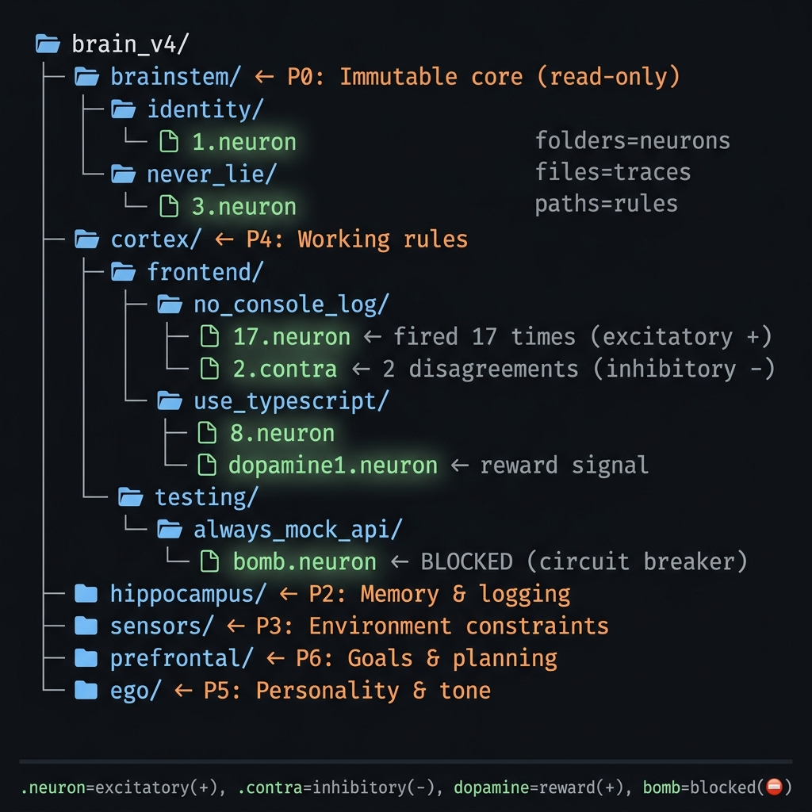

<p align="center">
  
  
  
  
  
</p>

<p align="center">
  
  <br/>
  <sub>라이브 대시보드: 329 뉴런, 7개 영역. 실시간 활성화 모니터링.</sub>
</p>

<p align="center"><a href="README.ko.md">🇰🇷 한국어</a> · <a href="README.md">🇺🇸 English</a> · <a href="MANIFESTO.md">📜 매니페스토</a></p>

# 🧠 NeuronFS

**폴더가 뉴런이다. 경로가 문장이다. 카운터가 시냅스 가중치다.**

> *"프롬프트로 구걸하지 마. 파이프라인을 설계해."*

### 목차

| | 섹션 | 알 수 있는 것 |
|---|---|---|
| 🔴 | [문제](#문제) | 텍스트 기반 AI 규칙이 왜 실패하는가 |
| 💡 | [구조다](#텍스트가-아니다-구조다) | `mkdir`이 수천 줄 프롬프트를 대체하는 방법 |
| 🏆 | [폴더가 이기는 이유](#폴더가-전부를-이기는-이유) | $0 vs 월 $70 벡터 DB — 벤치마크 포함 |
| ⚖️ | [하네스](#하네스-규칙이-법이-되는-구조) | 3-tier 주입, 서킷 브레이커, brainstem 보호 |
| 🔮 | [팔란티어 인사이트](#팔란티어-인사이트) | $100B 기업이 "멍청한 AI + 엄격한 구조"로 성공한 이유 |
| 🏗️ | [아키텍처](#아키텍처) | 자율 루프, 실행 스택, CLI |
| ⚠️ | [한계](#한계) | 안 되는 것에 대한 솔직한 이야기 |
| 📖 | [이야기](#이야기) | 단답이 명언이면 뇌가 더 똘똑해지는 이유 |

---

## 문제

우리는 AI에게 텍스트로 구걸한다.

*"이 규칙 잊지 마."* *"절대 fallback 쓰지 마라고."* *"36번째 말했는데."*

수천 줄 시스템 프롬프트. 월 $70짜리 벡터 DB. RAG 파이프라인에 서버, 임베딩, 코사인 유사도까지 — "console.log 쓰지 마" 하나 말하려고.

토큰 압력이 올라가면 AI는 전부 무시한다. 프롬프트는 제안이지, 법이 아니다.

> *"프롬프트 엔지니어링은 블랙박스에 노예가 되는 행위다 — 빌고, 청하고, 기어다니는."*

---

## 텍스트가 아니다. 구조다.

> *"개념을 구현하려는 시도는 많았지만 폴더라는 아이디어가 핵심이었다."*

NeuronFS는 텍스트 기반 AI 규칙을 **OS 파일시스템 구조**로 대체한다.

```bash
mkdir -p brain/cortex/testing/no_console_log
touch brain/cortex/testing/no_console_log/1.neuron
```

이게 뉴런이다. 경로 = 규칙. 파일명 = 카운터. 인프라 제로.

<p align="center">
  
</p>

| 개념 | 생물학적 뇌 | NeuronFS | OS 프리미티브 |
|------|-----------|----------|-------------|
| 뉴런 | 세포체 | 디렉토리 | `mkdir` |
| 규칙 | 발화 패턴 | 전체 경로 | 경로 문자열 |
| 가중치 | 시냅스 강도 | 카운터 파일명 | `N.neuron` |
| 억제 | 억제성 신호 | 반대 파일명 | `N.contra` |
| 보상 | 도파민 | 보상 파일명 | `dopamineN.neuron` |
| 연결 | 축삭 | 심링크 / `.axon` | `ln -s` |
| 수면 | 시냅스 정리 | `*.dormant` | `mv` |
| 차단 | 손상 | `bomb.neuron` | `touch` |

**극성 모델(Polarity Model):** 모든 뉴런의 세 가지 신호로 순가중치를 계산한다:

```
순가중치 = Counter(+) - Contra(-) + Dopamine(+)
극성     = (Counter + Dopamine - Contra) / 전체    # -1.0 ~ +1.0
```

**극성 = 방향. 강도 = 크기.** Counter=1000, Polarity=+0.8인 뉴런은 Counter=2, Polarity=+1.0인 뉴런보다 훨씬 강하다.

| 극성 | 의미 | 효과 |
|------|------|------|
| +0.7 ~ +1.0 | 강한 흥분 | 확고한 규칙 |
| +0.3 ~ +0.7 | 약한 흥분 | 유효하지만 이견 있음 |
| -0.3 ~ +0.3 | 중립/갈등 | 합의 필요 |
| -1.0 ~ -0.3 | 강한 억제 | 반대 기록됨, dormant 전환 |

> *"파일은 없어. 그 폴더만 있으면 돼. 파일은 완전 변경이 가능해. 뉴런의 발화는 적의 흔적을 쫓이다."*

### 축삭(Axon) — 영역 간 배선

뉴런은 뇌 영역 안에 산다. **축삭**은 영역과 영역을 연결한다 — 생물학적 축삭이 뇌 영역을 계층 네트워크로 묶는 것과 같다.

```
brainstem ←→ limbic ←→ hippocampus ←→ sensors ←→ cortex ←→ ego ←→ prefrontal
  (P0)         (P1)       (P2)          (P3)       (P4)     (P5)      (P6)
```

각 `.axon` 파일이 타겟 영역을 선언한다:

```bash
brain_v4/brainstem/cascade_to_limbic.axon      → "limbic"     # bomb이면 감정 차단
brain_v4/sensors/cascade_to_cortex.axon        → "cortex"     # 환경 제약이 지식 필터링
brain_v4/cortex/shortcut_to_hippocampus.axon   → "hippocampus" # 학습 결과를 기억에 기록
```

**축삭이 하는 일:**
- **캐스케이드 억제:** 하위 P가 상위 P를 억제. brainstem에 bomb이면 → limbic 축삭 → "상위 전체 중단"
- **컨텍스트 라우팅:** sensors → cortex 축삭 = "지식 적용 전 환경 제약 확인"
- **스킬 연결:** `cortex/skills/supanova/ref.axon` → 외부 SKILL.md 파일 연결

현재 **16개 축삭**이 7개 뇌 영역을 계층 캐스케이드로 연결 (긴급 경로 3개 포함).

**스케일에서 축삭이 핵심인 이유:** 326개 뉴런은 트리를 눈으로 볼 수 있다. 3,000개 뉴런이 20개 영역에 분산되면? 축삭 없이는 영역이 사일로가 된다 — 보안팀 뉴런이 배포팀 뉴런에 영향을 못 준다. 축삭은 "cortex/deployment 규칙 적용 전에 sensors/compliance부터 확인하라"는 명시적 계약이다. **뇌가 커질수록 축삭이 개별 뉴런보다 중요해진다** — 조직이 어떻게 사고하는지의 위상 구조.

> *"뉴런은 무엇을 아는가. 축삭은 지식이 어떻게 흐르는가."*

---

## 폴더가 전부를 이기는 이유

> *"폴더는 디스크 서비스. 종속성이 없어. 구조 자체가 가치가 없어."*

| | NeuronFS | .cursorrules | Mem0 / RAG |
|---|---|---|---|
| **설치** | `mkdir` | 파일 생성 | pip + DB + 모델 |
| **비용** | **$0** | $0 | $50-70+/월 |
| **속도** | ~1ms (syscall) | 파일 읽기 | 50-500ms |
| **종속성** | **없음** | IDE 종속 | Python, DB, API |
| **멀티 에이전트** | NAS 공유 폴더 | ❌ | 복잡한 IPC |
| **버전 관리** | `git diff` 네이티브 | git 가능 | ❌ |

거짓 숫자 없다. 2026-03-29, 로컬 Windows 11 SSD에서 측정.

### 측정 벤치마크

| 지표 | 수치 |
|------|------|
| 전체 스캔 (326 뉴런) | ~1ms |
| 규칙 추가 | `touch` <1ms |
| 가중치 변경 | 파일명 변경 <1ms |
| 콜드 스타트업 | 0초 (파일시스템이 이미 존재) |
| 1,000 뉴런 스트레스 테스트 | 271ms (3회 평균) |
| brain 디스크 사용량 | 4.3MB |
| 런타임 비용 | **$0** |

---

## 하네스: 규칙이 법이 되는 구조

> *"한 번에 안 되더라도 괜찮아. 진짜 여러 번 반복되는 것만 알아차려야 해."*

### 3-Tier 주입: 필요한 것만 적재

```
Tier 1: Bootstrap (GEMINI.md)   → TOP 5 핵심 규칙. 매 세션 자동 로드. ~1,830 토큰
Tier 2: 영역 트리거              → 영역별 뉴런 목록. 참조만 됨. ~500 토큰/영역
Tier 3: 전체 규칙                → 상세 규칙 텍스트. 온디맨드 API 적재
```

### 자동 발견: 빈도가 진리다

| 카운터 | 강도 | 동작 |
|--------|------|------|
| 1-4 | 일반 | `_rules.md`에만 기록 |
| 5-9 | 반복됨 | 강력 마크 |
| 10+ | **확신** | bootstrap에 발견. 매 세션 주입 |

36번 교정받은 규칙은 매 세션에 있다. AI가 "교정 받자, 실행 안 해"를 36번 반복했고. 이제 그건 법이다.

### 서킷 브레이커: 차단도 기능이다

| 신호 | 파일 | 트리거 |
|------|------|--------|
| 발화 | `N.neuron` | 교정 시 카운터 +1 |
| 보상 | `dopamineN.neuron` | 칭찬 시 보상 신호 |
| **차단** | `bomb.neuron` | 동일 실수 3회 → **전체 출력 중단** |
| 수면 | `*.dormant` | 30일 미접촉 시 자동 정리 |

`bomb.neuron`은 서킷 브레이커다. 제안이 아니다. 경고가 아니다. **하드 스탑이다.**

### 방어 계층: 뉴런 하이재킹 방지

```
brain_v4/
├── brainstem/    [P0] 정체성 — "빼면 안 되는 것"     → 안전 최우선
├── limbic/       [P1] 감정 및 자동 반응
├── hippocampus/  [P2] 기억 및 세션 복원
├── sensors/      [P3] 환경 및 OS 제약
├── cortex/       [P4] 직접 규칙 — "이거 이렇게 해라"
├── ego/          [P5] 성향 및 결과 스타일
└── prefrontal/   [P6] 목표 및 "다음에 뭘 할 건지"    → 가장 낮은 우선순위
```

P0이 P6을 항상 이긴다. Rodney Brooks의 subsumption architecture에서 빌려왔다. **안전 규칙의 임의 변경을 반드시 막기 위해서다.**

---

## 팔란티어 인사이트

> *"팔란티어가 했어. 멍청한 AI로."*

팔란티어는 세계 최고의 AI를 쓰지 않는다. **평범한 AI를 잔인하게 엄격한 구조(온톨로지) 안에 가둔다.** 각 결정은 수천 개의 트랜지스터급 Yes/No 게이트를 통과한다. 각 게이트는 평범한 모델로도 100% 맞출 만큼 단순하다. 캐스케이드의 결과물은 일관되고 신뢰할 수 있다.

**이건 이미 오래전에 증명됐다.** 팔란티어는 AGI를 기다리지 않고 *평범한 AI 주변의 구조*를 완성해서 $100B+ 기업을 만들었다. NeuronFS는 같은 교훈을 적용한다: 모델을 똑똑하게 만들지 마 — 파이프라인을 엄격하게 만들어.

> *"트랜지스터 레벨 입도. 팔란티어가 쓰는 방식."*
>
> *"온톨로지는 뇌를 복제한 거야."*

NeuronFS는 같은 원리를 비용 제로로 구현한다:

| | 팔란티어 AIP | NeuronFS |
|---|---|---|
| 구조 | 온톨로지 (엔티티 + 링크) | 폴더 (뉴런 + 경로) |
| AI 모델 | 아무 모델 | 아무 모델 |
| 게이트 단위 | 마이크로 결정 노드 | 0-바이트 뉴런 폴더 |
| 비용 | 엔터프라이즈 $$$$ | **$0** |
| 강제력 | 파이프라인 하드코딩 | 하네스 하드코딩 |

> *"엔터프라이즈급 구조 통제를 $0에, OS 파일시스템 위에 내렸다."*

**현재 운영 환경:** Windows 11, Google Antigravity (DeepMind), 326 뉴런, 2026-01부터 매일 실전 운영.

---

## 경쟁사 비교

|  | .cursorrules | Mem0 | Letta (MemGPT) | **NeuronFS** |
|--|-------------|------|----------------|-------------|
| 규칙 1000+ 관리 | 토큰 초과 ❌ | ✅ (벡터DB) | ✅ (계층메모리) | ✅ (폴더 트리) |
| 인프라 비용 | ₩0 | 서버/API $$$ | 서버 $$$ | **₩0** |
| AI 교체 시 | 파일 복사 | 마이그레이션 | 마이그레이션 | **그대로** (폴더임) |
| 사용자 규칙 소유 | ✅ | ❌ (AI 추출) | ❌ (에이전트 관리) | **✅ (mkdir)** |
| 자가 성장 | ❌ | ✅ | ✅ | **✅ (교정→뉴런)** |
| 불변 가드레일 | ❌ | ❌ | ❌ | **✅ (brainstem chmod 444)** |
| 감사 가능성 | git diff | 쿼리 | 로그 | **ls -R** |

### 출력물 예시

**`brainstem/_rules.md`** — 폴더 구조에서 자동 생성. chmod 444. 건드릴 수 없음:

```markdown
# 🛡️ BRAINSTEM — 양심/본능
Active: 24 | Dormant: 0 | Activation: 138

- 절대 **禁영어사고 한국어로 생각하고 대답** (13)
- **禁뉴런구조 임의변경** (3)
- **토론말고 실행** (2)
- **PD단답이 시스템의 근원** (1)
```

**`neuronfs --emit gemini` → `GEMINI.md`** — 모든 뉴런이 하나의 시스템 프롬프트로 컴파일:

```markdown
## 🛡️ brainstem (P0 — 절대 불변)
- 절대 **禁영어사고**: 한국어로 생각하고 대답 [13회 교정]
- **토론말고 실행** [2회 교정]

## 🧠 cortex (P4 — 지식/기술)
- agent ops: 반드시 **no pm solo work** [6회]
- backend/supabase: **RLS 항상켜기** [1회]
...
(326 뉴런 → ~8KB 시스템 프롬프트)
```

---

## 아키텍처

### Antigravity 연동

NeuronFS는 **Google Antigravity** (DeepMind의 에이전트 AI 코딩 어시스턴트)와 Windows에서 함께 쓴다. Chrome DevTools Protocol (CDP)로 연동:

1. **CDP Auto-Accept** — Node.js 스크립트가 `localhost:9000`으로 Antigravity에 연결, AI 생성 액션을 자동 승인
2. **실시간 대화 전사** — PD/AI 대화를 캐처하여 버퍼링
3. **유휴 감지 Groq 분석** — 5분 유휴 시 Groq LLaMA가 전사 버퍼를 분석하여 교정/위반/인사이트 추출
4. **자동 뉴런 성장** — 교정이 `_inbox/corrections.jsonl`에 기록되고, `neuronfs --supervisor`가 `fsnotify`로 감지하여 뉴런으로 변환

> *CDP 자동 승인 연동은 별도 리포지토리로 공개 예정.*

**운영 환경:** Windows 11, Google Antigravity (DeepMind), 326 뉴런, 2026-01부터 실전 운영 중.

### 자율 루프

```
AI 출력 → [auto-accept] → _inbox → [fsnotify] → 뉴런 성장
           ↑                                      ↓      Groq 분석
           └──────────────────────────────────────┘       규칙 재주입
                                                          뉴런 교정 → AI 행동 변경
```

### 실행 스택

```
neuronfs --supervisor        → 단일 바이너리가 전체 프로세스를 관리
├── auto-accept.mjs          → CDP 자동 승인 + 교정 감지
├── bot-heartbeat.mjs        → 주기적 에이전트 브리핑
├── bot-bridge.mjs           → 멀티 에이전트 메시지 전달
├── neuronfs --watch         → 파일 감시 + 뉴런 숙성
└── neuronfs --api           → 대시보드 + REST API (포트 9090)
```

### 왜 Go인가

NeuronFS 런타임은 **단일 Go 바이너리**다. Python 없음. Node.js 런타임 의존성 없음. Docker 없음.

| 이유 | 이점 |
|------|------|
| **단일 바이너리** | `go build` → `neuronfs.exe` 하나. 아무 머신에 복사. 끝. |
| **크로스 컴파일** | Windows에서 `GOOS=linux go build`. ARM, x86, Mac — 전부 한 머신에서 |
| **fsnotify 네이티브** | 폴링 없이 실시간 파일 감시. 뉴런 변경 감지 < 10ms |
| **고루틴** | Supervisor가 5개 이상 자식 프로세스를 동시 관리. 스레드 오버헤드 제로 |
| **GC 압력 제로** | 폴더 1만 개 스캔 < 50ms. JVM 워밍업 없음 |
| **정적 링크** | `.dll` 없음, `node_modules/` 없음, `pip install` 없음. 바이너리가 곧 런타임 |

뇌가 제로 인프라면, 런타임도 제로 인프라여야 한다. 바이너리 하나, 폴더 하나, 뇌 하나.

### 지원 에디터

어떤 것이든 어떤 에디터든. `--emit`으로 어떤 AI 코딩 어시스턴트든 규칙 파일을 생성한다.

```bash
neuronfs <brain_path> --emit gemini     # → GEMINI.md
neuronfs <brain_path> --emit cursor     # → .cursorrules
neuronfs <brain_path> --emit claude     # → CLAUDE.md
neuronfs <brain_path> --emit copilot    # → .github/copilot-instructions.md
neuronfs <brain_path> --emit all        # → 모든 포맷 동시 출력
```

### CLI 레퍼런스

```bash
neuronfs <brain_path>               # 진단 스캔
neuronfs <brain_path> --api         # 대시보드 (포트 9090)
neuronfs <brain_path> --mcp         # MCP 서버 (stdio)
neuronfs <brain_path> --watch       # 파일 감시 + 자동 숙성
neuronfs <brain_path> --supervisor  # 프로세스 매니저 (메인 루프)
neuronfs <brain_path> --grow <path> # 뉴런 생성
neuronfs <brain_path> --fire <path> # 카운터 증가
neuronfs <brain_path> --decay       # 30일 미접촉 시 수면 처리
neuronfs <brain_path> --snapshot    # Git 스냅샷
```

뇌를 복사하려면: `cp -r brain/ new-project/brain/`. 그게 전부다.

---

## 한계

솔직하게. 사실만.

**강제력이 없다.** AI가 GEMINI.md를 무시하면 막을 방법이 없다. 위반은 하네스가 사후에 잡는다. 이건 근본적 한계다.

**시맨틱 검색이 없다 — 설계 의도다.** 벡터 임베딩이 없다. 경로를 알아야 한다. 하지만 핵심은 뉴런이 *매일 갱신된다는 것*이다. 벡터 DB는 정적 스냅샷을 저장하고, NeuronFS는 살아 있는 구조를 저장한다. 500 뉴런 이상이면 `tree`나 대시보드를 쓴다.

**자작극 위험.** GEMINI.md를 시스템 프롬프트로 넣으면 AI가 따르는 건 당연하다. 그건 NeuronFS의 공이 아니라 시스템 프롬프트의 공이다. 진짜 검증 = 있을 때 vs 없을 때 기반의 비교. 아직 안 했다.

**외부 사용자가 없다.** 현재 Windows 11 + Google Antigravity (DeepMind) 환경에서 326개 뉴런으로 실전 운영 중. 다른 환경에서의 검증은 아직 없다.

> 한계를 먼저 인정하면 신뢰가 된다. 숨기면 HN에서 3분 안에 찢긴다.

---

## 빠른 시작

```bash
git clone https://github.com/rhino-acoustic/NeuronFS.git
cd NeuronFS/runtime && go build -ldflags="-s -w" -trimpath -buildvcs=false -o ../neuronfs .

./neuronfs ./brain_v4           # 진단 스캔
./neuronfs ./brain_v4 --api     # 대시보드 (localhost:9090)
./neuronfs ./brain_v4 --mcp     # MCP 서버 (stdio)
```

---

## 이야기

> *"명언이 모이면 뇌고. 그게 문맥."*
실전의 PD가 만들었다. 영상이 본업이고 코딩은 취미다.

AI가 "console.log 쓰지 마"를 9번 어겼다. 10번째에 `mkdir brain/cortex/frontend/coding/禁console_log`를 만들었다. 폴더 이름이 규칙이 된다. 파일 이름이 카운터가 된다. 지금 17이다. AI가 더 이상 안 어긴다.

### 왜 만들었나

NeuronFS는 실제 필요에서 태어났다: **회사의 지식베이스 완성.** VEGAVERY RUN®은 CRM, 영상 제작, 브랜드 디자인, 이커머스를 PD 한 명이 AI와 운영한다. 지식은 대화, 문서, 사람의 머릿속에 흩어져 있었다.

목표는 단순했다: 미래에 어떤 AI가 VEGAVERY 작업을 시작하든, 모든 규칙과 선호와 과거 실수를 **즉시** 알아야 한다. 50페이지 온보딩 문서가 아니라, 폴더 구조 자체에서.

### 왜 단답이 중요한가

교정은 항상 **단답**이다. 사용자는 에세이를 쓰지 않는다:
- *"fallback 쓰지 마"* → `mkdir 禁fallback` → 뉴런 1개
- *"토론말고 실행"* → `mkdir 推토론말고_실행` → 뉴런 1개

**단답 하나 = 뉴런 하나.** 단답들이 쌓이면 폴더 트리가 된다. 폴더 트리가 뇌다.

**그리고 여기가 핵심이다:** 단답이 단순한 교정이 아니라 **명언**이면? 뇌는 더 똑똑해진다.

- *"console.log 쓰지 마"* → 기술적 교정. 좋다.
- *"프롬프트로 구걸하지 마. 파이프라인을 설계해."* → 철학. **뇌의 근본 방향이 바뀐다.**
- *"명언이 모이면 뇌고. 그게 문맥."* → 메타 인식. 뇌가 자기 자신을 이해한다.

같은 326개 뉴런이라도, 명언과 철학이 들어있는 뇌는 **단순 규칙만 들어있는 뇌와 질적으로 다르다.**

### 상상해보라

**신입 개발자가 팀에 합류한다.** 200페이지 문서를 읽는 대신 `brain/`을 클론한다 — AI가 이미 "console.log 쓰지 마", "실행 전 계획", "프로덕션 DB 직접 건드리지 마"를 안다. 326개 교정이 1ms에 읽히는 폴더 트리.

**회사가 Claude에서 Gemini로 바꾼다.** 아무 것도 안 변한다. 뇌는 폴더다. 어떤 AI든 읽는다. 마이그레이션 비용 제로.

**병원이 의료 AI에 NeuronFS를 배포한다.** `brainstem/NEVER_hallucinate_dosage/` — chmod 444. 아무리 "창의적인" AI라도 이 규칙을 무시 못한다. 가드레일이 시스템 프롬프트의 기도문이 아니라 폴더다.

**로펌이 여러 사무소 간 뉴런을 공유한다.** NAS 공유 폴더. 도쿄와 서울이 같은 `brain/legal/contracts/` 뉴런을 읽는다. `robocopy`로 1시간마다 동기화. 인프라 비용 제로.

**10개 AI 에이전트가 공장을 관리한다.** 각 에이전트가 `brain/base/`를 fork하여 전문 뉴런으로 진화. 품질관리 에이전트: 500 뉴런. 물류 에이전트: 300 뉴런. 모두 `brainstem/`은 공유 — 헌법적 규칙.

326개 뉴런. 런타임 제로. 종속성 제로. 파일시스템 자체가 프레임워크다.

> *"프롬프트로 구걸하지 마. 파이프라인을 설계해."*
>
> *"개인이 기업을 이기는 시대. 공짜로 온다."*

**⭐ 동의하면 Star. [아니면 Issue.](../../issues)**

---

MIT License · Copyright (c) 2026 박정근(PD) — VEGAVERY RUN®

[📜 전체 매니페스토](MANIFESTO.md) · [@rubises](https://instagram.com/rubises)
