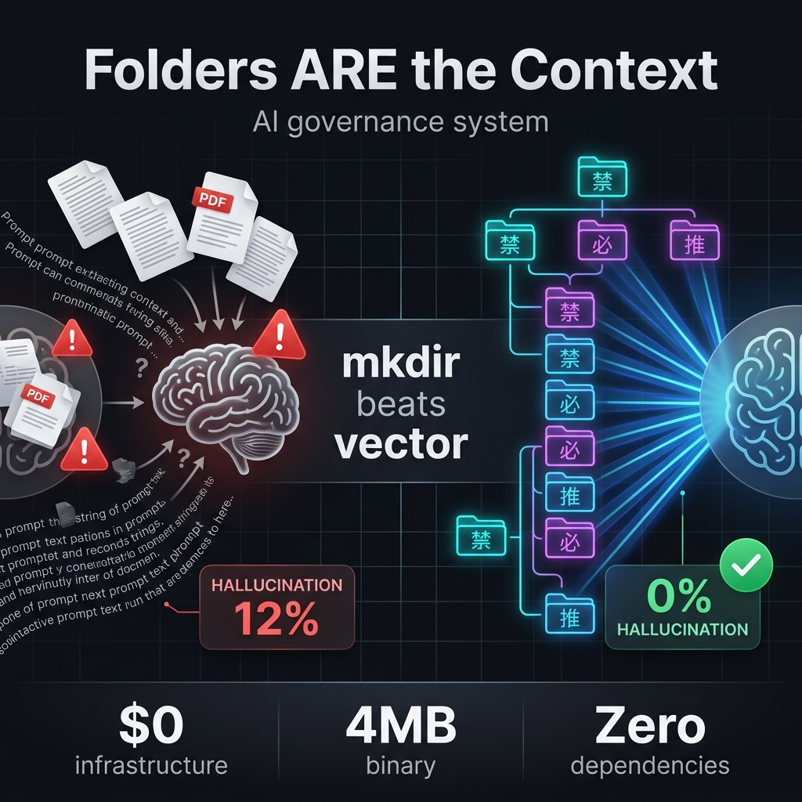

<p align="center">
  
  
  
  
  
  
</p>

<p align="center">
  
</p>

<p align="center">
  <a href="https://dashboarddeploy-six.vercel.app/"><strong>Live 3D Dashboard Demo</strong></a>
</p>

<p align="center"><a href="README.ko.md">🇰🇷 한국어</a> · <a href="README.md">🇺🇸 English</a></p>

# NeuronFS
### *Filesystem-native hierarchical rule memory — Zero-dependency Harness Engineering*

> *"Instead of cramming more context into a giant AI model, design the skeleton (structure) so perfectly that dependence on AI converges to zero."*
>
> AI disobeyed "don't use console.log" 9 times. On the 10th, `mkdir brain/cortex/frontend/coding/禁console_log` was created. The folder name was physically injected into the system prompt. The counter (weight) hit 17. AI never repeated that mistake again.
>
> This is the essence of **Harness Engineering** — what NeuronFS was built to do.

---

## Why NeuronFS? — One Table Says It All

| # | | `.cursorrules` | Mem0 / Letta | RAG (Vector DB) | **NeuronFS** |
|---|---|---|---|---|---|
| 1 | **Rule accuracy** | Text = easily ignored | Probabilistic | ~95% | **100% deterministic** |
| 2 | **Hallucination** | Prompt-dependent | 5%+ residual | 5–12% | **0% (path = truth)** |
| 3 | **Lookup speed** | Full-text scan | API latency | 200–2000ms | **0.001ms (B-Tree O(1))** |
| 4 | **Multi-AI support** | ❌ Cursor-only | API-dependent | ✅ | **✅ `--emit all` → every IDE** |
| 5 | **Switch AI tools** | Rules evaporate | Re-integrate | Re-index | **Same brain, always** |
| 6 | **Self-evolution** | Manual edit | Black box | Black box | **🧬 Autonomous (Groq LLM)** |
| 7 | **Priority system** | ❌ Flat text | ❌ | ❌ | **✅ 7-layer Subsumption (P0→P6)** |
| 8 | **Kill switch** | ❌ | ❌ | ❌ | **✅ `bomb.neuron` halts region** |
| 9 | **Rule conflict resolution** | Hope for the best | Undefined | Top-K ≠ Top-priority | **P0 physically overrides P4** |
| 10 | **Infrastructure cost** | Free | $50+/mo server | $70+/mo GPU | **$0 (local OS)** |
| 11 | **Dependencies** | IDE-locked | Python + Redis + DB | Python + GPU + API | **Zero (single 4MB Go binary)** |
| 12 | **Backup on overwrite** | ❌ | ❌ | N/A | **✅ Auto-backup `.neuronfs_backup/`** |
| 13 | **Auto-detect editors** | N/A | N/A | N/A | **✅ `--emit auto`** |
| 14 | **Encrypted brain portability** | ❌ | Cloud-dependent | Cloud-dependent | **✅ XChaCha20 `.jloot` cartridges** |
| 15 | **Cross-region intelligence** | ❌ | ❌ | Embedding similarity | **✅ `.axon` Attention Residuals** |
| 16 | **Logic gates in rules** | ❌ Text only | ❌ | ❌ | **✅ 禁(NOT) / 必(AND) / 推(OR)** |
| 17 | **Rule as OS enforcement** | Text suggestion | API suggestion | Statistical match | **Kernel inode = physical wall** |
| 18 | **Add a rule** | Edit text file | API call | Embed → index → store | **`mkdir 禁/rule` (0ms, $0)** |
| 19 | **Audit trail** | ❌ | Partial | ❌ | **✅ OS timestamps + git snapshots** |
| 20 | **Brain commerce** | N/A | N/A | N/A | **✅ Sell `.jloot` curated brains** |

> **`mkdir` replaces your system prompt.** A folder is a neuron, a path is a sentence, a file is a synaptic weight.

---

## Quickstart

**The One-Liner (원라이너):**
```bash
git clone https://github.com/rhino-acoustic/NeuronFS.git && cd NeuronFS/runtime && go build -o neuronfs . && ./neuronfs --emit all
```
This single line clones, builds, and compiles all AI system prompts from the included 677-neuron demo brain.

**Step by Step (단계별):**
```bash
# 1. Clone & build
git clone https://github.com/rhino-acoustic/NeuronFS.git
cd NeuronFS/runtime
go build -o neuronfs .          # → ~4MB binary, zero dependencies

# 2. Create a rule — just create a folder
mkdir 禁/fallback               # "禁" = absolute prohibition opcode
# That's it. A zero-byte folder IS the rule.

# 3. Compile brain → system prompts for ANY AI tool
./neuronfs --emit all            # → .cursorrules + CLAUDE.md + GEMINI.md + all formats
```

> ⚠️ **Auto-Backup:** `--emit` will **automatically back up** your existing `.cursorrules`, `CLAUDE.md`, `GEMINI.md`, etc. before overwriting. Backups are saved to `<brain>/.neuronfs_backup/` with timestamps. To restore, copy the `.bak` files back to their original locations.

**What happens when you run `--emit all`:**
```
🧬 NeuronFS online · 677 neurons · 12 plaques
═══ NeuronFS v4.0 — Folder-as-Neuron Engine ═══

[BACKUP] 💾 .cursorrules → brain_v4/.neuronfs_backup/.cursorrules.20260408_082008.bak
[BACKUP] 💾 CLAUDE.md → brain_v4/.neuronfs_backup/CLAUDE.md.20260408_082008.bak
[BACKUP] 💾 GEMINI.md → brain_v4/.neuronfs_backup/GEMINI.md.20260408_082008.bak
[EMIT] ✅ Cursor → .cursorrules
[EMIT] ✅ Claude → CLAUDE.md
[EMIT] ✅ Gemini → ~/.gemini/GEMINI.md
[EMIT] ✅ Copilot → .github/copilot-instructions.md

⚠️  3 existing rule file(s) were backed up to: brain_v4/.neuronfs_backup/
⚠️  To restore: copy .bak files back to their original locations.
✅ 4 targets written. 677 neurons active.
```

**Install scripts (설치 스크립트):**
```bash
# Mac / Linux
curl -sL https://raw.githubusercontent.com/rhino-acoustic/NeuronFS/main/install.sh | bash

# Windows (PowerShell)
iwr https://raw.githubusercontent.com/rhino-acoustic/NeuronFS/main/install.ps1 -useb | iex
```

**Advanced commands (고급 명령):**
```bash
neuronfs --init ./my_brain               # Initialize empty brain (7 regions scaffolded)
neuronfs ./my_brain --emit all           # Compile to ALL AI formats at once
neuronfs ./my_brain --emit auto          # 🔍 Auto-detect: only emit to editors you actually use
neuronfs ./my_brain --emit cursor        # Cursor only (.cursorrules)
neuronfs ./my_brain --grow cortex/react/禁console_log  # Create a prohibition neuron
neuronfs ./my_brain --fire cortex/react/禁console_log  # Reinforce (+1 weight)
neuronfs ./my_brain --evolve             # AI-powered autonomous evolution (dry run)
neuronfs ./my_brain --evolve --apply     # Execute evolution
neuronfs ./my_brain --api                # 3D Dashboard (localhost:9090)
```

> 💡 **`--emit auto`** scans your project for existing editor configs (`.cursorrules`, `CLAUDE.md`, `.github/`, `~/.gemini/`) and only generates files for editors you already use. No extra files. If nothing is detected, falls back to `all`.

---

## Table of Contents

| | Section | Content |
|---|---|---|
| 💡 | [Core Architecture](#core-architecture) | Folder = Neuron, Path = Sentence, Counter = Weight |
| 🎮 | [Opcodes are Runewords](#opcodes-are-runewords) | 禁/必/推 — Diablo 2 Runeword governance |
| 🧠 | [7-Layer Brain](#7-layer-brain-subsumption-cascade) | Subsumption Architecture: P0 always overrides P6 |
| ⚡ | [Why mkdir Beats Vector](#why-mkdir-beats-vector) | B-Tree O(1) vs Vector DB O(n) |
| 🔒 | [Jloot VFS Engine](#jloot-vfs-engine) | Brainwallet + XChaCha20 encrypted cartridges |
| 🏗️ | [Harness Engineering](#harness-engineering-the-next-paradigm) | The paradigm after Context Engineering |
| ⚖️ | [Governance](#governance) | Circuit breaker, bomb.neuron, 3-Tier injection |
| 📊 | [Benchmarks](#benchmarks) | Performance numbers, competitor comparison |
| 🎯 | [Market Position](#market-position) | L1 Governance infra, not just AI memory |
| ⚠️ | [Limitations](#limitations-honestly) | What we can't do (yet) |
| ❓ | [FAQ](#faq) | Hard questions, honest answers |
| 📜 | [Wiki & Chronicles](#official-wiki--chronicles) | 22 episodes of battle-tested philosophy |
| 🔮 | [100 Potentials](#the-100-potentials) | Wings of imagination |

---

## Core Architecture

> **Unix said "Everything is a file." We say: Everything is a folder.**

| Concept | Biology | NeuronFS | OS Primitive |
|---------|---------|----------|-------------|
| Neuron | Cell body | Directory | `mkdir` |
| Rule | Firing pattern | Full path | Path string |
| Weight | Synaptic strength | Counter filename | `N.neuron` |
| Reward | Dopamine | Reward file | `dopamineN.neuron` |
| Kill | Apoptosis | `bomb.neuron` | `touch` |
| Sleep | Synaptic pruning | `*.dormant` | `mv` |
| Axon | Axon terminal | `.axon` file | Symlink |
| Cross-ref | Attention Residual | Axon Query-Key matching | Selective aggregation |

### Path = Sentence

A path IS a natural language command. Depth IS specificity:

```
brain/cortex/NAS_transfer/                     → Category
brain/cortex/NAS_transfer/禁Copy-Item_UNC/      → Specific behavioral law
brain/cortex/NAS_transfer/robocopy_large/        → Detailed context
```

Compiled output: `cortex > NAS_transfer > 禁Copy-Item UNC incompatible`

### Kanji Micro-Opcodes

`禁` (1 char) = `NEVER_DO` (8 chars). Folder names compress 3–5× more semantic meaning per token:

| Kanji | Meaning | Example |
|-------|---------|---------|
| **禁** | Prohibition | `禁fallback` |
| **必** | Mandatory | `必KI_auto_reference` |
| **推** | Recommendation | `推robocopy_large` |
| **警** | Warning | `警DB_delete_confirm_required` |

---

## Opcodes are Runewords

If you played Diablo 2 — **NeuronFS opcodes work exactly like Runewords.**

A Runeword is a specific combination of runes socketed into the right item base. The magic isn't in any single rune — it's in the **exact combination + exact socket type**.

| Opcode | Rune | Effect | Example |
|---|---|---|---|
| `禁/` | Zod | **Absolute prohibition** — AI physically cannot cross | `禁/hardcoding/` |
| `必/` | Ber | **Mandatory gate** — AI must pass through | `必/manager_approval/` |
| `推/` | Ist | **Recommendation** — soft nudge, overridable | `推/test_code/` |
| `.axon` | Jah | **Teleport** — connects two distant brain regions | `推/insurance.axon => [claims/]` |
| `bomb` | El Rune | **Kill switch** — entire region freezes | `bomb.neuron` |

> *"The folder is the socket. The opcode is the rune. The combination is the Runeword."*

### Nested Opcodes — Prohibition + Resolution in One

NeuronFS's killer pattern: nest opcodes to chain prohibition and solution hierarchically.

```
brainstem/禁/no_shift/必/stack_solution/
         ↑ prohibition  ↑ resolution
```

Read as: *"Prohibit shift (禁), but mandate stacking as the solution (必)."*

**This is what happens when text becomes a folder hierarchy — governance emerges.** Writing "no shift, use stacking instead" in a text file is flat. As a folder hierarchy, there's a **parent-child relationship** between prohibition and resolution.

> *"A folder name is a philosophical declaration. Nesting creates hierarchy. Hierarchy creates governance."*

---

## 7-Layer Brain (Subsumption Cascade)

Seven brain regions layered via Brooks' Subsumption Architecture. **Lower P (priority) ALWAYS structurally overrides higher P.**

```
brainstem(P0) > limbic(P1) > hippocampus(P2) > sensors(P3) > cortex(P4) > ego(P5) > prefrontal(P6)
```

```
brain_v4/
├── brainstem/     (P0 — Absolute principles, brainstem)
├── limbic/        (P1 — Emotion filters, hormones)
├── hippocampus/   (P2 — Memory, error patterns)
├── sensors/       (P3 — Environmental constraints)
├── cortex/        (P4 — Knowledge, coding rules)
├── ego/           (P5 — Personality, tone)
└── prefrontal/    (P6 — Goals, planning)
```

| Brain Region | Priority | Role | Example |
|---|---|---|---|
| **brainstem** | P0 | Immutable absolute laws | `禁fallback`, `禁SSOT_duplicate` |
| **limbic** | P1 | Emotion filters, hormones | `dopamine_reward`, `adrenaline_emergency` |
| **hippocampus** | P2 | Memory, session restoration | `error_patterns`, `KI_auto_reference` |
| **sensors** | P3 | Environmental constraints | `NAS/禁Copy`, `design/sandstone` |
| **cortex** | P4 | Knowledge, skills (largest) | `react/hooks`, `backend/supabase` |
| **ego** | P5 | Tone, personality | `expert_concise`, `korean_verify` |
| **prefrontal** | P6 | Goals, projects | `current_sprint`, `long_term` |

**Core rule:** brainstem(P0)'s `禁` rules always beat cortex(P4)'s dev rules. Always. Physically.

---

## Why mkdir Beats Vector

> **"mkdir beats vector."** — A zero-byte folder is a deterministic O(1) wall. A vector DB is a probabilistic O(n) guess.

```
[Vector DB Search]
Input text → Embedding model (GPU) → 1536-dim vector →
Cosine similarity (billions of vectors × matrix multiply) → "89% probability answer"
⏱️ Latency: 200~2000ms | 💰 Cost: GPU required | Accuracy: probabilistic

[OS Folder Search (NeuronFS)]
Question → tokenize → B-Tree path traversal →
Load .neuron file at that path → "This path has 禁 — BLOCKED"
⏱️ Latency: 0.001ms | 💰 Cost: $0 (CPU only) | ✅ Accuracy: 100% deterministic
```

While vector DB rummages through billions of vectors thinking *"hmm, 89% probability..."*, `mkdir` delivers a nanosecond-level **absolute deterministic** verdict: *"ROAD BLOCKED."*

### Folder = Key-Value Map: RAG at $0

The filesystem isn't just a data container — it's a perfectly optimized **Map/Trie data structure**:

| | RAG (Vector DB) | Folder Map (NeuronFS) |
|---|---|---|
| Method | Vector similarity calc | Direct path lookup |
| Latency | ~200ms | **0.001ms** |
| Accuracy | ~95% | **100%** |
| Cost | GPU/API | **$0** |
| Hallucination | 5% residual | **0%** |

> *"It's not 'search the library for a similar book.' It's 'read memory address 0x0F (cortex/react) directly.' We replaced AI memory from an ocean of text into physical spatial coordinates."*

### B-Tree: Why Folder Search Beats Vector Search

```
What the user did:        mkdir P0_rules/禁/launch
What the OS handled:      ext4 → htree (B-Tree variant) auto-indexed
                          NTFS → B+Tree MFT auto-updated
                          APFS → B-Tree Copy-on-Write auto-placed
```

No code needed. You free-ride on 30 years of infrastructure optimized by Linus Torvalds and Bill Gates.

### N-Dimensional OS Metadata as Embedding

Vector DBs convert text into 1536-dim float arrays. NeuronFS uses OS metadata as N-dimensional embedding:

| Dimension | Vector DB | NeuronFS (OS Metadata) |
|---|---|---|
| **Semantics** | 1536-dim float vector | Folder name = natural language tag |
| **Priority** | ❌ Cannot express | File size (bytes) = weight |
| **Time** | ❌ Cannot express | Access timestamp = recency filter |
| **Synapse** | ❌ Cannot express | Symbolic link (.axon) = cross-domain |
| **Hierarchy** | ❌ All flattened | Folder depth = structural priority |
| **Logic** | ❌ Cannot express | 禁(NOT) / 必(AND) / 推(OR) = logic gates |

### 4 Competing Camps — and the Only Gap

```
DSPy        → Python code level
Guidance    → GPU token masking level
Neuro-sym   → Mathematical logic level
Subsumption → Hardware robotics level
━━━━━━━━━━━━━━━━━━━━━━━━━━━━━━━━━━━
NeuronFS    → OS filesystem level  ← the only one
```

---

## Jloot VFS Engine

The encrypted cartridge architecture that makes brain commerce possible.

- **RouterFS (`vfs_core.go`)**: O(1) Copy-on-Write routing for memory-disk union
- **Boot Ignition (`vfs_ignition.go`)**: Argon2id KDF Brainwallet integration
- **Crypto Cartridge (`crypto_cartridge.go`)**: XChaCha20-Poly1305 RAM-based decryption of `.jloot` payloads

```mermaid
graph TD
    A[Mnemonic Input] -->|Argon2id| B(32B Master Key)
    B -->|XChaCha20| C{crypto_cartridge.go}
    D[base.jloot File] --> C
    C -->|Extract purely in RAM| E[bytes.Reader Payload]
    E -->|zip.NewReader| F[Virtual Lower Directory]
    G[Physical UI/HDD] -->|O(1) Route| H[Virtual Upper Directory]
    F -->|vfs_core.go| I((Global VFS Shadowing Router))
    H -->|Copy-on-Write / Sandboxing| I
```

The cartridge data lives **only in runtime RAM** and vanishes when power is cut. Zero disk traces.

---

## Harness Engineering: The Next Paradigm

```
2023: Prompt Engineering   — "Write better prompts"
2024: Context Engineering  — "Provide better context"
2025: Harness Engineering  — "Design a skeleton where AI CANNOT fail"
```

NeuronFS is **the working implementation of Harness Engineering** — not asking AI to follow rules, but making it structurally impossible to break them.

### Proof of Pain

**WITHOUT NeuronFS:**
```
Day 1:  AI violates "don't use console.log" → manual correction
Day 2:  Quota exhausted, switch to another AI → same violation repeats
Day 3:  Repeat. Day 4: Repeat. Day 10: You lose your mind.
```

**WITH NeuronFS:**
```
Day 1:  mkdir brain/cortex/禁console_log → violation permanently blocked
Day 2:  Switch AI → --emit all → same brain, same rules
Day 10: Zero violations. Structure remembers what every AI forgets.
```

### Autonomous Harness Cycle

Every 25 interactions, the harness engine (Node.js sidecar) automatically:

1. Analyzes **failure patterns** in correction logs
2. Uses Groq LLM to **auto-generate 禁(prohibition)/推(recommendation) neurons**
3. Creates **`.axon` cross-links** between related regions
4. That mistake becomes **structurally impossible to repeat** — the system blocks it, not the prompt

### Auto-Evolution Pipeline

`.cursorrules` is a static file that forces manual editing. NeuronFS evolves autonomously:

1. **auto-consolidate**: Resolves folder fragmentation. LLM classifies similar error folders and merges them into single neurons, inheriting counters.
2. **auto-neuronize**: Analyzes correction logs to generate inhibitory (Contra) rules preventing recurrence.
3. **auto-polarize**: Detects positive "use_X" rules and auto-proposes powerful inhibitory micro-opcode versions ("禁X").

### Attention Residuals (Cross-Region Intelligence)

Inspired by [Kimi's Attention Residuals paper](https://arxiv.org/abs/2603.15031), `.axon` connections enable **selective cross-reference**:

- TOP neurons in each region generate **query keywords**
- Match against **key paths** in connected regions
- Top 3 related neurons auto-surface in `_rules.md`
- Governance neurons (禁/推) get unconditional boost

---

## Governance

### Circuit Breaker (bomb.neuron)

| bomb Location | Result |
|---|---|
| brainstem (P0) | **Entire brain halts.** GEMINI.md empties — AI is effectively silenced. |
| cortex (P4) | Only brainstem~sensors render. That knowledge domain is perfectly isolated. |

`bomb.neuron` doesn't beg "please don't do this" — it **stops the prompt rendering pipeline for that entire region.**
To restore: `rm brain_v4/.../bomb.neuron` — delete one file.

### Harness Safeguards

- Brainstem immutability verification; destruction on tampering
- Axon integrity checking
- `Pre-Git Lock` snapshots before destructive commands (forced data recovery)
- `SafeExec` 30-second deadlock timeout capsule (infinite loop defense)
- **Autonomous Harness Cycle**: Groq-powered 禁/推 neuron auto-generation every 25 interactions
- **Attention Residuals**: `.axon` cross-links for selective inter-region reference

---

## Benchmarks

| Metric | Value |
|---|---|
| Active Neurons | **3,400+** (7 regions, 10 axons) |
| Total Activation | **25,800+** synaptic weights |
| 3,400 folder scan speed | Under 1 second |
| Rule folder creation | OS-native (`mkdir`), 0ms |
| Go source | **30 files, ~10,920 lines** (modular) |
| Build time | **8.3 seconds** (single binary) |
| Local disk usage | 4.3MB (pure text/folder structure) |
| Maintenance/runtime cost | **$0** |
| brainstem (P0) compliance | **94.9%** (18 violations in 353 injections) |

### Competitor Comparison

| | `.cursorrules` hardcoding | Vector DB (RAG) | **NeuronFS (CLI)** |
|---|---|---|---|
| 1000+ rules | Token explosion, maintenance hell | ✅ Fast search | **✅ OS folder tree distributed** |
| Infrastructure cost | Free | Server rental ($70/mo) | **Free ($0)** |
| Multi-AI | ❌ IDE-locked | ✅ API-based | **✅ `--emit all` (all formats)** |
| Self-growth | Impossible | Black box | **Visible folders (mkdir automation)** |
| Absolute principles | Beg via prompt | Limited | **✅ Circuit breaker (bomb.neuron)** |

---

## Market Position

> **NeuronFS is not AI agent memory. It's L1 governance infrastructure.**

```
L3: AI Agent Memory  (Mem0, Letta, Zep)         — conversation memory, user profiling
L2: IDE Rules        (.cursorrules, CLAUDE.md)   — static rule files, IDE-locked
L1: AI Governance    (NeuronFS) ◀── HERE         — model-agnostic · self-evolving · consistency guaranteed
```

### The Multi-AI Consistency Problem

2026 reality: **Quota limits force every developer to mix multiple AIs.**

```
Morning: Claude (Opus quota burnt) → Afternoon: switch to Gemini → Evening: switch to GPT
Claude's learned "禁console.log" rule → Gemini doesn't know → violation again → pain
```

`.cursorrules` is Cursor-only. `CLAUDE.md` is Claude-only. **Switch AI = rules evaporate.**

NeuronFS's answer: **One brain → all formats simultaneously.**

### The WordPress Analogy

WordPress is free. Themes and plugins are paid. Similarly:
- **NeuronFS engine**: Free ($0) — open source
- **Curated Master Brain**: Premium — battle-tested governance packages for React, Next.js, Supabase, etc.

`.cursorrules` files can't be sold. **A brain forged through 10,000 corrections can.**

### Hybrid Architecture: NeuronFS + RAG

**"We don't reject RAG. We control RAG's hallucinations as an L1 governance cache."**

* **Tier 1 & 2 (NeuronFS deterministic):** Immutable rules (`brainstem`), workflow constraints (`sensors`). Core governance like "mandatory DB backup" or "禁plaintext tokens" must not rely on probability. They need hard locks.
* **Tier 3 (Vector DB / RAG delegation):** Massive API specs, years of error logs (`hippocampus`). Delegate to LlamaIndex or existing RAG frameworks for flexibility.

Think of it as: **L1 instruction cache (NeuronFS) + L2 main RAM (RAG).**

---

## Limitations (Honestly)

| Issue | Reality |
|---|---|
| Mass accessibility | "I have to create folders? I'll just use ChatGPT." |
| Ecosystem scale | Still a solo project |
| Marketing | Explaining this concept in 30 seconds is brutally hard |
| Scale ceiling | 1M folders? OS can handle it. Human cognition can't. |

**Design answer to the scale ceiling:** L1/L3 dual structure was designed anticipating this wall. NeuronFS works best as an **L1 cache** gripping the agent's throat — not as a hard drive for millions of records.

---

## Philosophy: Palantir-Class Ontology

Why folders? Palantir's AIP exploded not because it uses the smartest AI, but because it binds enterprise data and actions into a single **ontology (structured reality)**.

NeuronFS brings that philosophy to the local filesystem. Instead of handing AI a 1,000-line text and begging "remember this," you fossilize your business logic into physical folder paths (`cortex/frontend/禁console_log`).

> *"When everyone was building spaceships (GPUs), someone asked: 'What if we strap a jet engine to a bicycle and arrive faster?' — Columbus's egg."*

---

## FAQ

**Q: "In the end, doesn't it compile back into a system prompt (text)? How is this different from writing rules in a text file or Notion?"**

**A:** Fundamentally different. Finding one rule in 1,000 lines of text spaghetti, adjusting its priority, deleting it — that drives you insane. We **elevated knowledge from "string space" to "OS physical folder space."** Instead of writing `!!IMPORTANT!!` dozens of times (begging via prompt), NeuronFS provides **permission separation (Cascade hierarchy)** and **access prohibition (bomb.neuron physical kill switch)**. When one fires, the entire tier's text literally stops rendering.

**Q: "If neurons (folders) exceed 1,000, won't prompt tokens explode?"**

**A:** Three defense layers: ① 3-Tier on-demand rendering (only folders matching conversation flow are dynamically bundled) ② 30-day idle folders enter dormant (sleep) state ③ `--consolidate` merging — Llama 3 or local models cleanly merge duplicate folders into single super-neurons.

**Q: "Why can't Big Tech do this?"**

**A:** Three reasons: **Money** — GPUs and cloud are their cash cow. "Folders are enough" is self-sabotage. **Laziness** — "Just throw a PDF at it, AI will figure it out" is too comfortable. **Vanity** — "mkdir? Too low-tech." — Exactly. That's why nobody did it. And that's why it works.

**Q: ".cursorrules and CLAUDE.md do the same thing, right?"**

**A:** The Big 4 already borrow the same principle — but they're all **1-dimensional text files**. NeuronFS uses **N-dimensional OS metadata**. `.cursorrules` says **"what to follow"** in text. NeuronFS expresses **"what, how important, since when, in what context"** via folder structure and OS metadata. These dimensions are **physically impossible to express** inside a text document.

---

## Self-Referential Architecture

NeuronFS's core principle — **"Path = Sentence"** — applies to its own codebase. The filenames alone tell the story:

```
brain.go → brain scan          inject.go → injection         emit.go → rule generation
lifecycle.go → lifecycle       evolve.go → evolution         similarity.go → similarity
neuron_crud.go → CRUD         watch.go → file watch          supervisor.go → management
```

This isn't just "good naming." It's a **recursive self-referential architecture that proves its own philosophy.** 30 files, ~10,920 lines — yet any AI can reconstruct full context in 30 seconds by reading filenames alone.

---

## CLI Reference

```bash
neuronfs <brain> --emit <target>   # Prompt compilation (gemini/cursor/claude/all)
neuronfs <brain> --consolidate     # Llama 3 70B merge engine
neuronfs <brain> --api             # Dashboard (localhost:9090)
neuronfs <brain> --watch           # File watch + live reload
neuronfs <brain> --grow <path>     # Create neuron
neuronfs <brain> --fire <path>     # Weight counter +1
neuronfs <brain> --diag            # Full brain tree visualization
```

### Why Go?

Single executable binary. Zero external dependencies (no node_modules, no Python venv). Download, drop in any folder, instantly monitors the file tree (`fsnotify`) and runs from terminal. Ultimate portability and permanence.

---

## Official Wiki & Chronicles (공식 위키)

All architecture specs, philosophy, and development chronicles are permanently preserved on **GitHub Wiki** under defensive publication principles for global IP protection.

> **[Access the NeuronFS Official Wiki (공식 위키 바로가기)](https://github.com/rhino-acoustic/NeuronFS/wiki)** — Korean original, English titles

### 4 Acts, 22 Episodes (4막 22화)

| Act | Theme | Episodes |
|---|---|---|
| **[Act 1 (의심과 발견)](https://github.com/rhino-acoustic/NeuronFS/wiki/Act-1)** | Suspicion & Discovery | 01-07 |
| **[Act 2 (시련과 워게임)](https://github.com/rhino-acoustic/NeuronFS/wiki/Act-2)** | Trial & Wargames | 08-11 |
| **[Act 3 (증명과 벤치마크)](https://github.com/rhino-acoustic/NeuronFS/wiki/Act-3)** | Proof & Benchmark | 12-16 |
| **[Act 4 (선언과 울트라플랜)](https://github.com/rhino-acoustic/NeuronFS/wiki/Act-4)** | Declaration & Ultraplan | 17-22 |

### Key Pages (주요 문서)

* **[🚀 Getting Started (5분 퀵스타트)](https://github.com/rhino-acoustic/NeuronFS/wiki/Getting-Started)** — Clone, build, run your first neuron
* **[Jloot VFS Architecture (엔진 해부)](https://github.com/rhino-acoustic/NeuronFS/wiki/Jloot-VFS-Architecture)** — Brainwallet + encrypted cartridge deep-dive
* **[100 Potentials (100가지 잠재력)](https://github.com/rhino-acoustic/NeuronFS/wiki/The-100-Potentials)** — Wings of imagination (상상의 나래)

---

## The 100 Potentials

> **[The 100 Potentials](https://github.com/rhino-acoustic/NeuronFS/wiki/The-100-Potentials)** — Wings of imagination for what Harness Engineering can become.

From OS mechanisms (symlinks as synapses, chroot as simulation prisons) to multi-agent telepathy (Named Pipes, NFS hive minds), to enterprise disruption (DRM-encrypted neurons, insured AGI), all the way to cosmic philosophy (digital funerals, quantum entanglement via hard links) — 100 butterfly effects mapped across 5 domains.

---

## Changelog

**v4.4 (2026-04-05)** — **Attention Residuals** cross-reference (`.axon` based). Autonomous Harness Cycle (Groq 禁/推 auto-gen). UTF-8 BOM parsing fix. 3400+ neurons, 10 axons.
**v4.3 (2026-04-02)** — Autonomous engine full Llama 3 porting ($0 cost) + SafeExec hard lock.
**v4.2 (2026-03-31)** — Auto-Evolution pipeline complete. Groq correction log analysis + Kanji micro-opcode optimization.

---

## License
This project is licensed under **AGPL-3.0** with additional commercial terms. See [LICENSE](LICENSE) for details.

---
> *A non-developer flipped the direction of an industry. Programming became philosophy once AI arrived.*
> *Created by 박정근 (PD) — rubisesJO777*
> *Architecture: 30 Go files, ~10,920 lines. Single binary. Zero dependencies.*

<!--
Easter Egg for the code divers:
Hey 666, easy - only the Word stands as absolute truth (777).
This? It's just a well-organized folder built by someone who wanted to vibe-code without going insane.
-->
