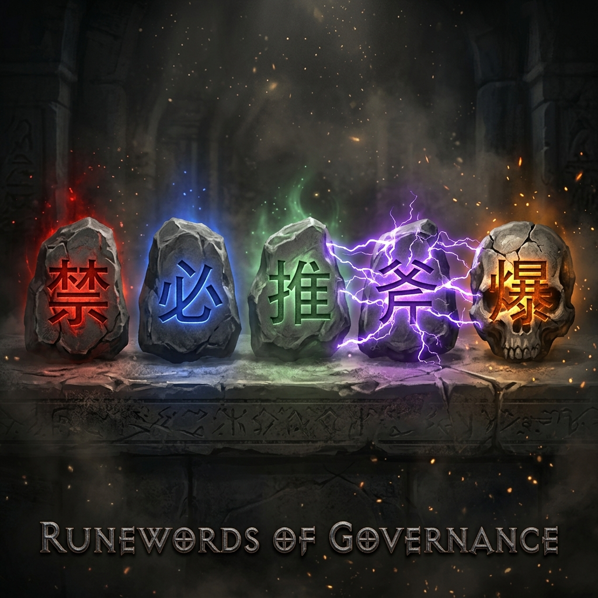

# Getting Started
## NeuronFS를 5분 안에 체험하기

> **Language Note / 언어 안내**
>
> **[ENG]** This page walks you through building and running NeuronFS from source. No dependencies required — just Go 1.21+ and a terminal.
>
> **[KOR]** NeuronFS를 소스에서 빌드하고 실행하는 방법을 안내합니다. Go 1.21+와 터미널만 있으면 됩니다.

---

## Prerequisites

- **Go 1.21+** (https://go.dev/dl/)
- **Git**
- Windows / macOS / Linux 모두 지원

---

## 1. Clone and Build

```bash
# Clone the repository
git clone https://github.com/rhino-acoustic/NeuronFS.git
cd NeuronFS/runtime

# Build (zero dependencies — single binary)
go build -o neuronfs .

# Verify
./neuronfs --help
```

빌드 결과: **약 4MB짜리 단일 바이너리**. 외부 의존성 0.

## 2. 뇌 구조 확인하기

```bash
# 현재 뇌 상태 출력 (read-only, 파일 변경 없음)
./neuronfs --emit

# 전체 뇌 구조를 트리로 시각화
./neuronfs --diag
```

`--emit`은 stdout에 현재 활성화된 뉴런 규칙들을 출력합니다. 이것만으로도 NeuronFS가 어떻게 작동하는지 바로 이해할 수 있습니다.

## 3. 뇌의 구조 탐색

```
brain_v4/
+-- brainstem/     (P0 — 절대 원칙, 뇌간)
|   +-- 禁/하드코딩/
|   \-- 禁/보안위반/
+-- limbic/        (P1 — 감정 필터)
+-- hippocampus/   (P2 — 기억, 에러 패턴)
+-- sensors/       (P3 — 환경 제약)
+-- cortex/        (P4 — 지식, 코딩 규칙)
|   +-- dev/
|   +-- methodology/
|   \-- frontend/
+-- ego/           (P5 — 성향, 톤)
\-- prefrontal/    (P6 — 목표, 계획)
```

**Core rule:** Lower P always physically overrides higher P.
brainstem(P0)'s 禁 rules always beat cortex(P4)'s dev rules.

### Opcodes are Runewords



If you played Diablo 2 — **NeuronFS opcodes work exactly like Runewords.**

A Runeword is a specific combination of runes socketed into the right item base. The magic isn't in any single rune — it's in the **exact combination + exact socket type**.

NeuronFS works the same way:

| Opcode | Rune | Effect | Example |
|---|---|---|---|
| `禁/` | Zod | **Absolute prohibition** — AI physically cannot cross | `禁/하드코딩/` |
| `必/` | Ber | **Mandatory gate** — AI must pass through | `必/부서장승인/` |
| `推/` | Ist | **Recommendation** — soft nudge, overridable | `推/테스트코드/` |
| `.axon` | Jah | **Teleport** — connects two distant brain regions | `推/보험료.axon => [보험금/]` |
| `bomb` | El Rune | **Kill switch** — entire region freezes | `bomb.neuron` |

> *"Socket a 禁 rune into a brainstem folder = indestructible wall. Socket a 推 rune into cortex = soft suggestion. The folder is the socket. The opcode is the rune. The combination is the Runeword."*

### Folder Names Carry Intent

A deeper insight: **opcodes don't just ban or allow — they declare intent and chain solutions.**

| Pattern | Meaning |
|---|---|
| `禁/하드코딩/` | "하드코딩을 금지한다" — 즉시 차단 |
| `必/부서장승인/` | "부서장 승인을 필수로 한다" — 통과 게이트 |
| `推/테스트코드/` | "테스트 코드를 추천한다" — 부드러운 권고 |
| `검증_후_보고` | "검증이 되어야 한다" — 미래 의도 선언 |

### Nested Opcodes — 금지와 해결을 하나로

**NeuronFS의 핵심 패턴:** 옵코드를 중첩하여 금지와 해결책을 계층으로 연결합니다.

```
brainstem/禁/쉬프트금지/必/적층해결/
         ↑ 금지         ↑ 해결책
```

읽는 법: *"시프트를 금지(禁)하되, 적층으로 해결(必)한다."*

**이것이 '문서가 폴더가 될 때 계층이 생긴다'의 실체입니다.** 텍스트로 "시프트 금지, 대신 적층할 것"이라고 쓰면 평면적이지만, 폴더 계층으로 만들면 금지와 해결책 사이에 **부모-자식 관계**가 생깁니다.

> *"A folder name is a philosophical declaration. Nesting creates hierarchy. Hierarchy creates governance."*

## 4. 첫 번째 뉴런 만들기

```bash
# 새 뉴런 생성
./neuronfs grow cortex/dev/my_first_rule

# 뉴런 발화 (활성화 +1)
./neuronfs fire cortex/dev/my_first_rule

# 뉴런에 도파민 신호 보내기 (강화)
./neuronfs signal dopamine cortex/dev/my_first_rule

# 변경 사항 IDE에 반영
./neuronfs --emit all
```

## 5. 자율 진화 체험

```bash
# Groq API 키 설정 (무료 tier 사용 가능)
export GROQ_API_KEY=your_key_here

# 뇌 자율 진화 시작 (dry run = 제안만)
./neuronfs --evolve

# 실제 진화 실행
./neuronfs --evolve --apply
```

AI가 축적된 시그널을 분석해서 새 뉴런을 자동 생성합니다.

---

## Demo Brain: 672 Neurons Starter Pack

이 레포지토리의 `brain_v4/` 디렉토리가 **실제 작동하는 672 뉴런짜리 뇌**입니다.
Clone하는 순간 즉시 사용 가능합니다.

| 영역 | 뉴런 수 | 설명 |
|---|---|---|
| brainstem (P0) | ~10 | 절대 금지 규칙 |
| hippocampus (P2) | ~103 | 에러 패턴, 에피소드 기억 |
| cortex (P4) | ~348 | 개발 지식, 방법론 |
| sensors (P3) | ~4 | 환경 변수 |
| ego (P5) | ~1 | 행동 양식 |
| prefrontal (P6) | ~2 | 장기 목표 |

> *"이 672개의 뉴런은 수천 시간의 실전 AI 에이전트 운용에서 축적된 교정(corrections)으로 만들어졌습니다. Clone하면 즉시 시니어 개발자의 뇌를 장착할 수 있습니다."*

---

## Next Steps

- [Episode 01: mkdir beats vector](Episode-01-Where-mkdir-Beats-Vector) -- 핵심 철학 이해
- [Episode 16: 7-Layer Brain](Episode-16-P0-Brainstem-Always-Overrides-P4-Cortex) -- Subsumption Cascade 이해
- [Jloot VFS Architecture](Jloot-VFS-Architecture) -- 암호화 카트리지 엔진

---

[Home](Home)